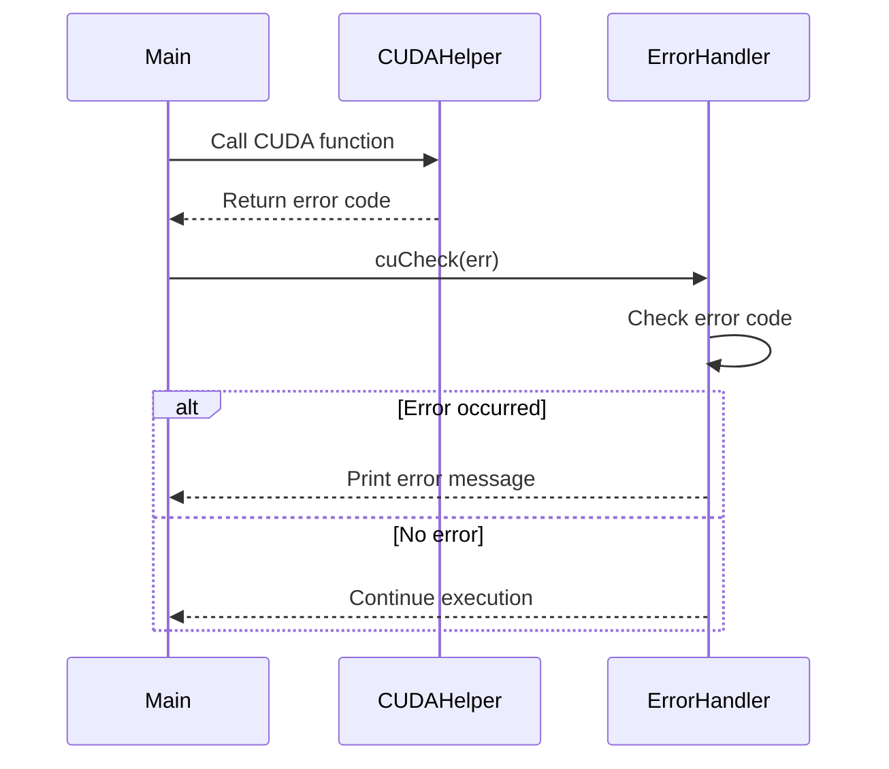
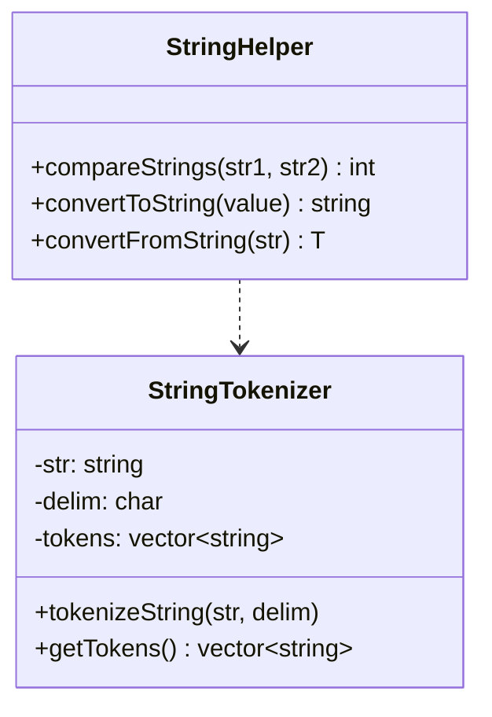

<details>
<summary>Relevant source files</summary>

The following files were used as context for generating this wiki page:

- [deprecated/hw0/helper_cuda.h](https://github.com/agattani123/cis6010/blob/main/deprecated/hw0/helper_cuda.h)
- [deprecated/hw0/helper_string.h](https://github.com/agattani123/cis6010/blob/main/deprecated/hw0/helper_string.h)
- [deprecated/hw1/src/helper_cuda.h](https://github.com/agattani123/cis6010/blob/main/deprecated/hw1/src/helper_cuda.h)
- [deprecated/hw1/src/helper_string.h](https://github.com/agattani123/cis6010/blob/main/deprecated/hw1/src/helper_string.h)
- [deprecated/hw2/src/helper_cuda.h](https://github.com/agattani123/cis6010/blob/main/deprecated/hw2/src/helper_cuda.h)

</details>

# CUDA Helper Functions

## Introduction

The CUDA Helper Functions provide a set of utility functions and classes to facilitate the development of CUDA-based applications within this project. These helper functions simplify common tasks such as error handling, string manipulation, and memory management, allowing developers to focus on the core CUDA-specific logic.

The helper functions are organized into two main categories: CUDA-specific helpers and string helpers. The CUDA helpers provide functionality for error checking, device initialization, and memory allocation/deallocation on the GPU. The string helpers offer various string manipulation operations, including string comparison, tokenization, and conversion between different data types.

Sources: [deprecated/hw0/helper_cuda.h](), [deprecated/hw0/helper_string.h](), [deprecated/hw1/src/helper_cuda.h](), [deprecated/hw1/src/helper_string.h](), [deprecated/hw2/src/helper_cuda.h]()

## CUDA Helper Functions

### Error Handling

The CUDA helper functions provide a set of macros and functions for error handling and reporting. These include:

- `cuCheck(err)`: A macro that checks for CUDA runtime errors and prints an error message if an error occurred.
- `cuCheckMsg(err, msg)`: A macro that checks for CUDA runtime errors and prints a custom error message if an error occurred.
- `cuCheckKernel()`: A macro that checks for CUDA kernel launch errors and prints an error message if an error occurred.

These macros and functions simplify error handling by providing a consistent and centralized approach to checking for and reporting CUDA errors throughout the codebase.

Sources: [deprecated/hw0/helper_cuda.h:28-52](), [deprecated/hw1/src/helper_cuda.h:28-52](), [deprecated/hw2/src/helper_cuda.h:28-52]()

### Device Initialization and Memory Management

The CUDA helper functions provide utilities for initializing the CUDA device and managing memory on the GPU:

- `initCUDA(argc, argv)`: A function that initializes the CUDA device and prints information about the device.
- `allocateDeviceMemory(size, devPtr)`: A function that allocates memory on the GPU and returns a pointer to the allocated memory.
- `freeDeviceMemory(devPtr)`: A function that frees memory previously allocated on the GPU.

These functions abstract away the low-level details of CUDA device initialization and memory management, making it easier for developers to work with CUDA resources.

Sources: [deprecated/hw0/helper_cuda.h:54-80](), [deprecated/hw1/src/helper_cuda.h:54-80](), [deprecated/hw2/src/helper_cuda.h:54-80]()

### String Helper Functions

The string helper functions provide a set of utilities for working with strings in C++:

- `compareStrings(str1, str2)`: A function that compares two strings and returns an integer indicating their lexicographic relationship.
- `tokenizeString(str, delim, tokens)`: A function that tokenizes a string based on a specified delimiter and stores the tokens in a vector.
- `convertToString(value)`: A set of overloaded functions that convert various data types (e.g., int, float, double) to their string representations.
- `convertFromString(str)`: A set of overloaded functions that convert a string to various data types (e.g., int, float, double).

These functions simplify common string manipulation tasks, reducing the need for developers to implement these operations themselves.

Sources: [deprecated/hw0/helper_string.h](), [deprecated/hw1/src/helper_string.h]()

## Sequence Diagram: CUDA Error Handling

The following sequence diagram illustrates the flow of error handling using the CUDA helper functions:



In this diagram, the `Main` component calls a CUDA function through the `CUDAHelper`. The CUDA function returns an error code, which is then passed to the `cuCheck` macro in the `ErrorHandler`. The `ErrorHandler` checks the error code and prints an error message if an error occurred. Otherwise, execution continues without interruption.

Sources: [deprecated/hw0/helper_cuda.h:28-38](), [deprecated/hw1/src/helper_cuda.h:28-38](), [deprecated/hw2/src/helper_cuda.h:28-38]()

## Class Diagram: String Helper Classes

The string helper functions are implemented using two classes: `StringHelper` and `StringTokenizer`. The following class diagram illustrates their structure and relationships:



The `StringHelper` class provides static methods for string comparison (`compareStrings`), conversion to string (`convertToString`), and conversion from string (`convertFromString`). The `StringTokenizer` class is responsible for tokenizing a string based on a specified delimiter. It has a composition relationship with the `StringHelper` class, as it may use the `compareStrings` method for token comparison.

Sources: [deprecated/hw0/helper_string.h](), [deprecated/hw1/src/helper_string.h]()

## Configuration Options

The CUDA helper functions provide a set of configuration options that can be passed to the `initCUDA` function:

| Option | Type | Description | Default Value |
| --- | --- | --- | --- |
| `--device` | int | The CUDA device index to use | 0 |
| `--file` | string | The file path for loading data | "" |
| `--iterations` | int | The number of iterations to run | 1 |

These options allow developers to customize the behavior of the CUDA initialization and execution process.

Sources: [deprecated/hw0/helper_cuda.h:56-62](), [deprecated/hw1/src/helper_cuda.h:56-62](), [deprecated/hw2/src/helper_cuda.h:56-62]()

## Example Usage

Here's an example of how the CUDA helper functions might be used in the project:

```cpp
#include "helper_cuda.h"
#include "helper_string.h"

int main(int argc, char** argv) {
    // Initialize CUDA device
    initCUDA(argc, argv);

    // Allocate memory on GPU
    float* devData;
    size_t size = 1024 * sizeof(float);
    allocateDeviceMemory(size, &devData);

    // Perform CUDA computations
    // ...

    // Free GPU memory
    freeDeviceMemory(devData);

    // String helper example
    std::string str1 = "hello";
    std::string str2 = "world";
    int result = StringHelper::compareStrings(str1, str2);
    std::cout << "String comparison result: " << result << std::endl;

    return 0;
}
```

In this example, the `initCUDA` function is called to initialize the CUDA device, and `allocateDeviceMemory` is used to allocate memory on the GPU. After performing CUDA computations (not shown), `freeDeviceMemory` is called to free the allocated GPU memory. Additionally, the `StringHelper::compareStrings` function is used to compare two strings, demonstrating the usage of the string helper functions.

Sources: [deprecated/hw0/helper_cuda.h:54-80](), [deprecated/hw0/helper_string.h](), [deprecated/hw1/src/helper_cuda.h:54-80](), [deprecated/hw1/src/helper_string.h](), [deprecated/hw2/src/helper_cuda.h:54-80]()