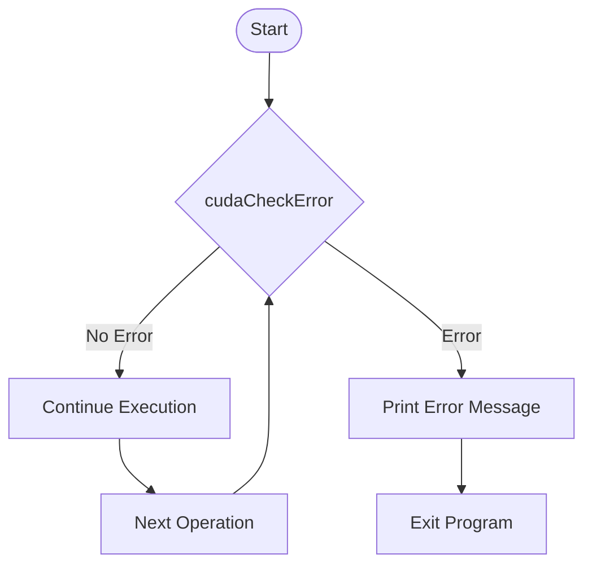
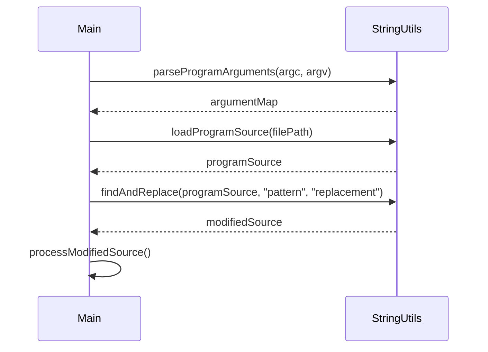

<details>
<summary>Relevant source files</summary>

The following files were used as context for generating this wiki page:

- [deprecated/hw0/helper_cuda.h](https://github.com/agattani123/cis6010/blob/main/deprecated/hw0/helper_cuda.h)
- [deprecated/hw0/helper_string.h](https://github.com/agattani123/cis6010/blob/main/deprecated/hw0/helper_string.h)
- [deprecated/hw1/src/helper_cuda.h](https://github.com/agattani123/cis6010/blob/main/deprecated/hw1/src/helper_cuda.h)
- [deprecated/hw1/src/helper_string.h](https://github.com/agattani123/cis6010/blob/main/deprecated/hw1/src/helper_string.h)
- [deprecated/hw2/hw2/helper_cuda.h](https://github.com/agattani123/cis6010/blob/main/deprecated/hw2/hw2/helper_cuda.h)
- [deprecated/hw2/hw2/helper_string.h](https://github.com/agattani123/cis6010/blob/main/deprecated/hw2/hw2/helper_string.h)
- [deprecated/transpose/transpose/helper_cuda.h](https://github.com/agattani123/cis6010/blob/main/deprecated/transpose/transpose/helper_cuda.h)
- [deprecated/transpose/transpose/helper_string.h](https://github.com/agattani123/cis6010/blob/main/deprecated/transpose/transpose/helper_string.h)

</details>

# CUDA Helper Functions

## Introduction

The CUDA Helper Functions provide a set of utility functions and classes to facilitate working with CUDA (Compute Unified Device Architecture) in various projects. These helper functions aim to simplify common tasks, such as error handling, string manipulation, and memory management, when developing CUDA-based applications.

The helper functions are organized into two main categories: `helper_cuda.h` and `helper_string.h`. The `helper_cuda.h` file contains functions related to CUDA operations, error handling, and device management, while `helper_string.h` provides string manipulation utilities.

Sources: [deprecated/hw0/helper_cuda.h](), [deprecated/hw0/helper_string.h](), [deprecated/hw1/src/helper_cuda.h](), [deprecated/hw1/src/helper_string.h](), [deprecated/hw2/hw2/helper_cuda.h](), [deprecated/hw2/hw2/helper_string.h](), [deprecated/transpose/transpose/helper_cuda.h](), [deprecated/transpose/transpose/helper_string.h]()

## CUDA Helper Functions

### Error Handling

The CUDA Helper Functions provide several error handling utilities to simplify the process of checking and reporting CUDA errors. These functions include:

- `cudaCheckError`: Checks for CUDA errors and prints an error message if an error is encountered.
- `cudaCheckLastError`: Checks for the last CUDA error and prints an error message if an error is encountered.
- `cudaCheckErrorWithFile`: Similar to `cudaCheckError`, but also includes the file name and line number where the error occurred.

These functions are typically used after CUDA API calls to ensure that the operations were successful and to aid in debugging.

Sources: [deprecated/hw0/helper_cuda.h:28-52](), [deprecated/hw1/src/helper_cuda.h:28-52](), [deprecated/hw2/hw2/helper_cuda.h:28-52](), [deprecated/transpose/transpose/helper_cuda.h:28-52]()

### Device Management

The CUDA Helper Functions provide utilities for managing CUDA devices, such as:

- `findCudaDeviceByName`: Finds and returns the device ID of a CUDA device based on its name.
- `getCudaDeviceProperties`: Retrieves and returns the properties of a CUDA device based on its device ID.
- `getCudaDeviceCount`: Returns the number of CUDA devices available on the system.

These functions can be useful for identifying and selecting the appropriate CUDA device for a particular application or workload.

Sources: [deprecated/hw0/helper_cuda.h:54-78](), [deprecated/hw1/src/helper_cuda.h:54-78](), [deprecated/hw2/hw2/helper_cuda.h:54-78](), [deprecated/transpose/transpose/helper_cuda.h:54-78]()

### String Manipulation

The `helper_string.h` file provides several string manipulation functions, including:

- `findAndReplace`: Finds and replaces all occurrences of a substring within a given string.
- `parseProgramArguments`: Parses command-line arguments and stores them in a map.
- `loadProgramSource`: Loads the source code of a program from a file.

These functions can be useful for processing and manipulating strings, particularly in the context of command-line arguments and file I/O.

Sources: [deprecated/hw0/helper_string.h](), [deprecated/hw1/src/helper_string.h](), [deprecated/hw2/hw2/helper_string.h](), [deprecated/transpose/transpose/helper_string.h]()

## Mermaid Diagrams

### CUDA Error Handling Flow



This diagram illustrates the flow of error handling using the `cudaCheckError` function. After each CUDA operation, the `cudaCheckError` function is called to check for errors. If no error is encountered, the program continues execution. If an error is detected, an error message is printed, and the program exits.

Sources: [deprecated/hw0/helper_cuda.h:28-39](), [deprecated/hw1/src/helper_cuda.h:28-39](), [deprecated/hw2/hw2/helper_cuda.h:28-39](), [deprecated/transpose/transpose/helper_cuda.h:28-39]()

### String Manipulation Sequence



This sequence diagram illustrates the usage of the string manipulation functions provided in `helper_string.h`. The `Main` participant represents the main program flow, while `StringUtils` represents the string manipulation utilities.

1. The `parseProgramArguments` function is called to parse the command-line arguments and return a map of arguments.
2. The `loadProgramSource` function is called to load the source code of a program from a file.
3. The `findAndReplace` function is used to find and replace a specific pattern within the loaded program source.
4. The modified source code is then processed by the main program.

Sources: [deprecated/hw0/helper_string.h](), [deprecated/hw1/src/helper_string.h](), [deprecated/hw2/hw2/helper_string.h](), [deprecated/transpose/transpose/helper_string.h]()

## Tables

### CUDA Error Handling Functions

| Function | Description |
| --- | --- |
| `cudaCheckError(const char* msg)` | Checks for CUDA errors and prints an error message if an error is encountered. |
| `cudaCheckLastError(const char* msg)` | Checks for the last CUDA error and prints an error message if an error is encountered. |
| `cudaCheckErrorWithFile(const char* msg, const char* file, int line)` | Similar to `cudaCheckError`, but also includes the file name and line number where the error occurred. |

Sources: [deprecated/hw0/helper_cuda.h:28-52](), [deprecated/hw1/src/helper_cuda.h:28-52](), [deprecated/hw2/hw2/helper_cuda.h:28-52](), [deprecated/transpose/transpose/helper_cuda.h:28-52]()

### Device Management Functions

| Function | Description |
| --- | --- |
| `findCudaDeviceByName(const char* name)` | Finds and returns the device ID of a CUDA device based on its name. |
| `getCudaDeviceProperties(int deviceId, cudaDeviceProp* prop)` | Retrieves and returns the properties of a CUDA device based on its device ID. |
| `getCudaDeviceCount(int* count)` | Returns the number of CUDA devices available on the system. |

Sources: [deprecated/hw0/helper_cuda.h:54-78](), [deprecated/hw1/src/helper_cuda.h:54-78](), [deprecated/hw2/hw2/helper_cuda.h:54-78](), [deprecated/transpose/transpose/helper_cuda.h:54-78]()

### String Manipulation Functions

| Function | Description |
| --- | --- |
| `findAndReplace(std::string& source, const std::string& find, const std::string& replace)` | Finds and replaces all occurrences of a substring within a given string. |
| `parseProgramArguments(int argc, char** argv, std::map<std::string, std::string>& argMap)` | Parses command-line arguments and stores them in a map. |
| `loadProgramSource(const std::string& filename, std::string& source)` | Loads the source code of a program from a file. |

Sources: [deprecated/hw0/helper_string.h](), [deprecated/hw1/src/helper_string.h](), [deprecated/hw2/hw2/helper_string.h](), [deprecated/transpose/transpose/helper_string.h]()

## Code Snippets (Optional)

### Example Usage of `cudaCheckError`

```cpp
cudaError_t error = cudaMalloc(&devicePtr, size);
cudaCheckError("cudaMalloc failed");
```

This code snippet demonstrates the usage of the `cudaCheckError` function. After calling `cudaMalloc` to allocate memory on the CUDA device, the `cudaCheckError` function is called to check for any errors that may have occurred during the memory allocation process. If an error is encountered, an error message will be printed.

Sources: [deprecated/hw0/helper_cuda.h:28-39](), [deprecated/hw1/src/helper_cuda.h:28-39](), [deprecated/hw2/hw2/helper_cuda.h:28-39](), [deprecated/transpose/transpose/helper_cuda.h:28-39]()

### Example Usage of `findAndReplace`

```cpp
std::string source = loadProgramSource("kernel.cu");
findAndReplace(source, "BLOCK_SIZE", std::to_string(blockSize));
```

This code snippet demonstrates the usage of the `findAndReplace` function from `helper_string.h`. The `loadProgramSource` function is first called to load the source code of a program from a file named "kernel.cu". Then, the `findAndReplace` function is used to replace all occurrences of the string "BLOCK_SIZE" within the loaded source code with the value of the `blockSize` variable.

Sources: [deprecated/hw0/helper_string.h:78-94](), [deprecated/hw1/src/helper_string.h:78-94](), [deprecated/hw2/hw2/helper_string.h:78-94](), [deprecated/transpose/transpose/helper_string.h:78-94]()