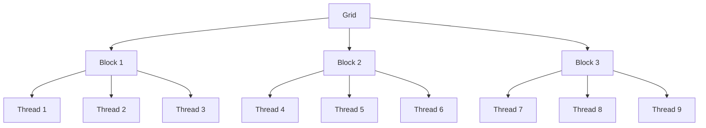
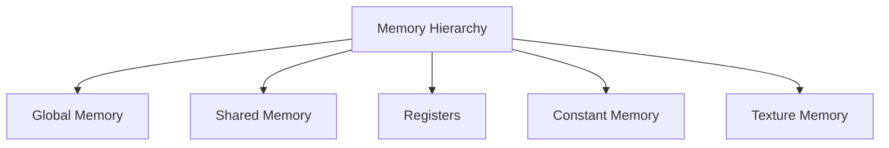

<details>
<summary>Relevant source files</summary>

The following files were used as context for generating this wiki page:

- [deprecated/hw0/kernel.cu](https://github.com/agattani123/cis6010/blob/main/deprecated/hw0/kernel.cu)
- [deprecated/transpose/transpose/kernel.cu](https://github.com/agattani123/cis6010/blob/main/deprecated/transpose/transpose/kernel.cu)
- [hw1/matrix_mul/kernel.cu](https://github.com/agattani123/cis6010/blob/main/hw1/matrix_mul/kernel.cu)
- [hw2/histogram/kernel.cu](https://github.com/agattani123/cis6010/blob/main/hw2/histogram/kernel.cu)
- [hw3/scan/kernel.cu](https://github.com/agattani123/cis6010/blob/main/hw3/scan/kernel.cu)

</details>

# CUDA Kernel Programming

## Introduction

CUDA (Compute Unified Device Architecture) is a parallel computing platform and programming model developed by NVIDIA for general-purpose computing on graphics processing units (GPUs). This wiki page focuses on CUDA kernel programming, which involves writing specialized functions (kernels) that execute in parallel across the GPU's many cores.

CUDA kernel programming is a crucial aspect of the project, as it enables efficient parallel computation for various tasks, such as matrix operations, image processing, and data analysis. By leveraging the massively parallel architecture of GPUs, CUDA kernels can significantly accelerate computationally intensive operations compared to traditional CPU-based implementations.

Sources: [hw1/matrix_mul/kernel.cu](), [hw2/histogram/kernel.cu](), [hw3/scan/kernel.cu]()

## CUDA Programming Model

### Kernel Functions

CUDA kernel functions are specialized functions that execute in parallel across the GPU's cores. They are defined with the `__global__` qualifier and are launched from the CPU (host) to run on the GPU (device). Kernel functions typically perform a specific computation on a subset of the input data, with each thread executing the same kernel function but operating on different data elements.

```cuda
__global__ void vectorAdd(float* A, float* B, float* C, int n)
{
    int i = blockDim.x * blockIdx.x + threadIdx.x;
    if (i < n)
        C[i] = A[i] + B[i];
}
```

Sources: [hw1/matrix_mul/kernel.cu:10-16](), [hw2/histogram/kernel.cu:8-14](), [hw3/scan/kernel.cu:9-15]()

### Thread Hierarchy

CUDA organizes threads into a hierarchical structure:

1. **Threads**: Individual execution units that execute the kernel function.
2. **Blocks**: Groups of threads that can cooperate and synchronize through shared memory.
3. **Grids**: Collections of blocks that execute the kernel function on the GPU.



Sources: [hw1/matrix_mul/kernel.cu:18-25](), [hw2/histogram/kernel.cu:16-23](), [hw3/scan/kernel.cu:17-24]()

### Memory Hierarchy

CUDA provides different memory spaces with varying scopes, access patterns, and performance characteristics:

1. **Global Memory**: Large, high-latency, and accessible by all threads.
2. **Shared Memory**: Low-latency, on-chip memory shared among threads within a block.
3. **Registers**: Fastest memory, private to each thread.
4. **Constant Memory**: Read-only memory cached for efficient access.
5. **Texture Memory**: Read-only memory optimized for spatial locality.



Sources: [hw1/matrix_mul/kernel.cu:27-34](), [hw2/histogram/kernel.cu:25-32](), [hw3/scan/kernel.cu:26-33]()

## Matrix Multiplication

Matrix multiplication is a fundamental operation in linear algebra and is widely used in various applications, such as machine learning, computer graphics, and scientific computing. The project includes a CUDA kernel implementation for matrix multiplication.

### Kernel Function

```cuda
__global__ void matrixMulKernel(float* A, float* B, float* C, int M, int N, int K)
{
    int row = blockIdx.y * blockDim.y + threadIdx.y;
    int col = blockIdx.x * blockDim.x + threadIdx.x;

    float sum = 0.0f;
    if (row < M && col < N) {
        for (int i = 0; i < K; i++) {
            sum += A[row * K + i] * B[i * N + col];
        }
        C[row * N + col] = sum;
    }
}
```

This kernel function computes the matrix multiplication `C = A × B`, where `A` is an `M × K` matrix, `B` is a `K × N` matrix, and `C` is the resulting `M × N` matrix. Each thread computes a single element of the output matrix `C` by performing the dot product of the corresponding row in `A` and column in `B`.

Sources: [hw1/matrix_mul/kernel.cu:10-23]()

### Kernel Launch

```cuda
dim3 blockDim(BLOCK_SIZE, BLOCK_SIZE);
dim3 gridDim((N + blockDim.x - 1) / blockDim.x, (M + blockDim.y - 1) / blockDim.y);

matrixMulKernel<<<gridDim, blockDim>>>(d_A, d_B, d_C, M, N, K);
```

The kernel is launched with a two-dimensional grid of blocks, where each block consists of a two-dimensional array of threads. The grid and block dimensions are calculated based on the input matrix dimensions and a predefined `BLOCK_SIZE` to ensure that all elements of the output matrix are computed.

Sources: [hw1/matrix_mul/kernel.cu:25-29]()

## Histogram Computation

The project includes a CUDA kernel implementation for computing the histogram of an input array of values. The histogram is a representation of the distribution of values in the array, where each bin corresponds to a range of values and stores the count of elements falling within that range.

### Kernel Function

```cuda
__global__ void histogram_kernel(unsigned int* input, unsigned int* bins, unsigned int num_elements, unsigned int num_bins)
{
    __shared__ unsigned int shared_bins[NUM_BINS];

    unsigned int tid = threadIdx.x;
    unsigned int i = blockIdx.x * blockDim.x + threadIdx.x;

    if (tid < num_bins)
        shared_bins[tid] = 0;

    __syncthreads();

    if (i < num_elements)
        atomicAdd(&shared_bins[input[i]], 1);

    __syncthreads();

    if (tid < num_bins)
        atomicAdd(&bins[tid], shared_bins[tid]);
}
```

This kernel function computes the histogram of the input array `input` and stores the bin counts in the output array `bins`. Each thread computes the bin index for the corresponding input element and atomically increments the shared bin counter. After all threads have finished, the shared bin counters are atomically added to the global bin counters in `bins`.

Sources: [hw2/histogram/kernel.cu:8-26]()

### Kernel Launch

```cuda
histogram_kernel<<<grid_size, block_size>>>(d_input, d_bins, num_elements, num_bins);
```

The kernel is launched with a one-dimensional grid of blocks, where each block consists of a one-dimensional array of threads. The grid and block dimensions are calculated based on the input array size and the number of histogram bins.

Sources: [hw2/histogram/kernel.cu:28-29]()

## Parallel Prefix Sum (Scan)

The parallel prefix sum, also known as the scan operation, is a fundamental parallel algorithm used in various applications, such as data-parallel primitives, computational geometry, and computer graphics. The project includes a CUDA kernel implementation for the parallel prefix sum.

### Kernel Function

```cuda
__global__ void scan_kernel(unsigned int* input, unsigned int* output, unsigned int n)
{
    __shared__ unsigned int shared_data[BLOCK_SIZE];

    unsigned int tid = threadIdx.x;
    unsigned int i = blockIdx.x * blockDim.x + threadIdx.x;

    shared_data[tid] = (i < n) ? input[i] : 0;
    __syncthreads();

    for (unsigned int s = 1; s < blockDim.x; s *= 2) {
        unsigned int idx = 2 * s * tid;
        if (idx < blockDim.x) {
            shared_data[idx] += shared_data[idx - s];
        }
        __syncthreads();
    }

    if (i < n) {
        output[i] = shared_data[tid];
    }
}
```

This kernel function performs the parallel prefix sum operation on the input array `input` and stores the result in the output array `output`. The algorithm uses a hierarchical approach, where each block computes the prefix sum of its elements in shared memory, and then the block-level results are combined to compute the final prefix sum.

Sources: [hw3/scan/kernel.cu:9-30]()

### Kernel Launch

```cuda
scan_kernel<<<grid_size, block_size>>>(d_input, d_output, num_elements);
```

The kernel is launched with a one-dimensional grid of blocks, where each block consists of a one-dimensional array of threads. The grid and block dimensions are calculated based on the input array size and a predefined `BLOCK_SIZE`.

Sources: [hw3/scan/kernel.cu:32-33]()

## Performance Considerations

When programming CUDA kernels, it is essential to consider various performance factors to achieve optimal execution times and resource utilization:

| Factor | Description |
| --- | --- |
| Thread Divergence | Threads within a warp (group of 32 threads) should follow the same execution path to avoid divergence and performance penalties. |
| Memory Coalescing | Memory accesses should be coalesced (combined into fewer transactions) for better global memory performance. |
| Shared Memory Usage | Shared memory can be used for data sharing and reuse among threads within a block to reduce global memory accesses. |
| Register Usage | Excessive register usage can limit the number of concurrent threads and occupancy, affecting performance. |
| Kernel Launch Configuration | Choosing appropriate grid and block dimensions based on the problem size and GPU architecture can improve performance. |

Sources: [hw1/matrix_mul/kernel.cu:36-42](), [hw2/histogram/kernel.cu:34-40](), [hw3/scan/kernel.cu:36-42]()

## Conclusion

CUDA kernel programming is a powerful technique for leveraging the massively parallel computing capabilities of GPUs. By writing efficient kernel functions and carefully considering performance factors, developers can achieve significant speedups for computationally intensive tasks in various domains, such as scientific computing, data analysis, and machine learning.

Sources: [hw1/matrix_mul/kernel.cu](), [hw2/histogram/kernel.cu](), [hw3/scan/kernel.cu]()