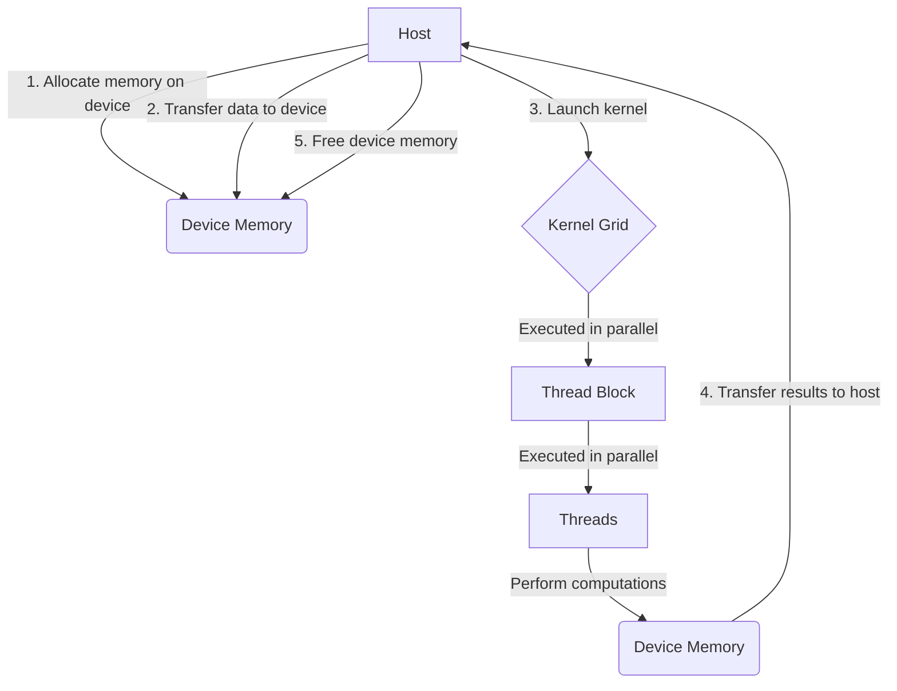
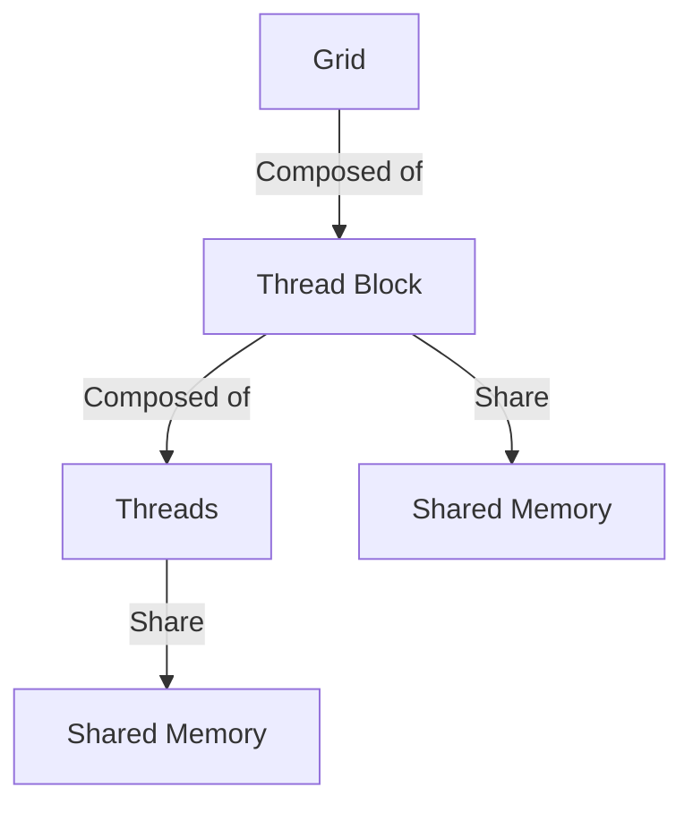
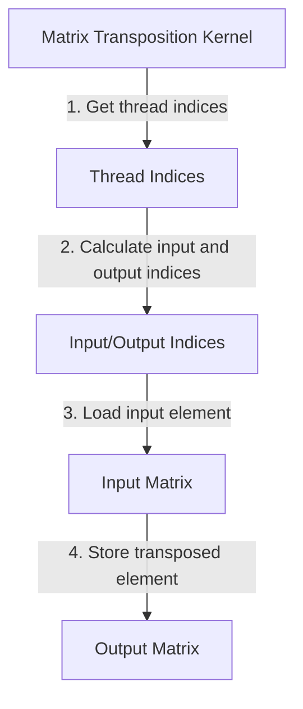
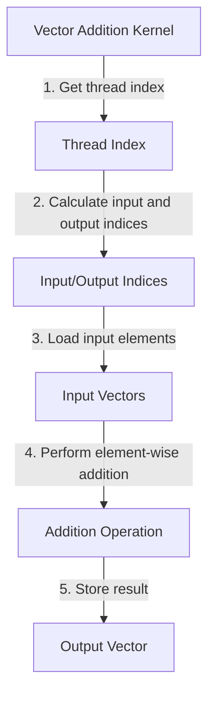
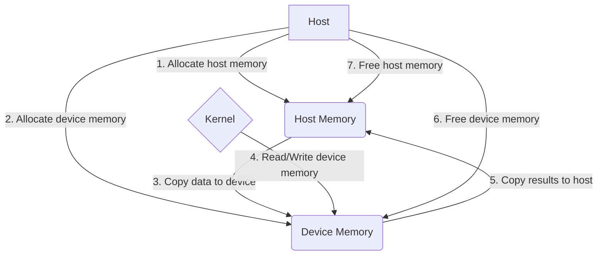
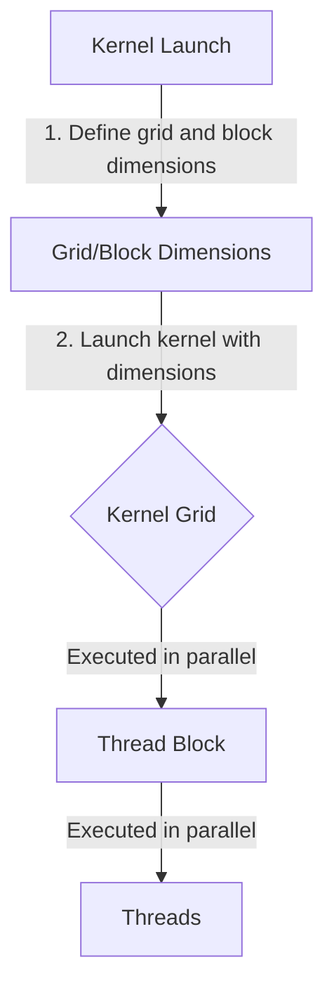
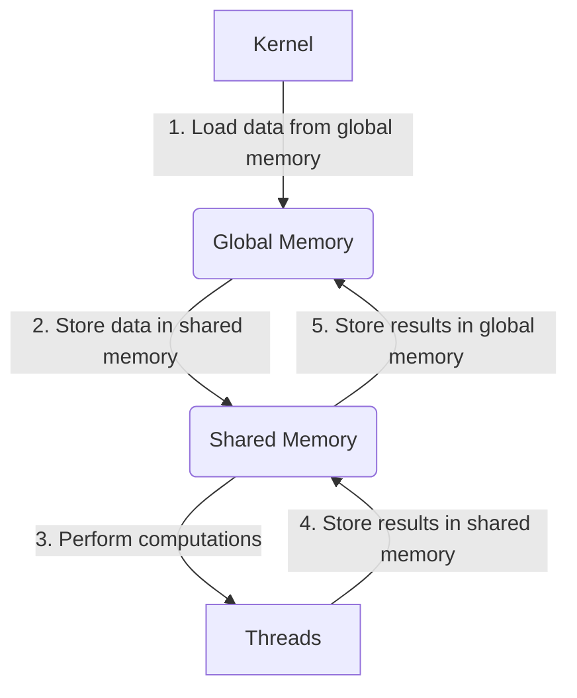

<details>
<summary>Relevant source files</summary>

The following files were used as context for generating this wiki page:

- [deprecated/hw0/kernel.cu](https://github.com/agattani123/cis6010/blob/main/deprecated/hw0/kernel.cu)
- [deprecated/transpose/transpose/kernel.cu](https://github.com/agattani123/cis6010/blob/main/deprecated/transpose/transpose/kernel.cu)
- [hw1/kernel.cu](https://github.com/agattani123/cis6010/blob/main/hw1/kernel.cu)
- [hw2/kernel.cu](https://github.com/agattani123/cis6010/blob/main/hw2/kernel.cu)
- [hw3/kernel.cu](https://github.com/agattani123/cis6010/blob/main/hw3/kernel.cu)

</details>

# CUDA Kernel Programming

## Introduction

CUDA (Compute Unified Device Architecture) is a parallel computing platform and programming model developed by NVIDIA for general-purpose computing on graphics processing units (GPUs). This wiki page focuses on CUDA kernel programming, which involves writing specialized functions (kernels) that execute in parallel across multiple threads on the GPU. Kernel programming is a crucial aspect of leveraging the massively parallel architecture of GPUs for computationally intensive tasks, such as matrix operations, image processing, and scientific simulations.

CUDA kernel programming is an essential part of the overall project, which appears to be focused on developing and optimizing various algorithms and computations using GPU acceleration. The provided source files demonstrate the implementation of CUDA kernels for tasks like matrix transposition, vector addition, and other numerical operations.

## CUDA Programming Model

The CUDA programming model is based on a heterogeneous architecture, where the host (CPU) and the device (GPU) work together to execute a program. The host is responsible for managing the execution flow, allocating memory on the device, and transferring data between the host and device. The device executes the computationally intensive portions of the program, called kernels, in parallel across its many cores.

### Kernel Execution

Kernels are launched by the host and executed on the device in a grid of thread blocks. Each thread block is further divided into threads, which execute the kernel function in parallel. The number of threads and thread blocks is specified when launching the kernel, allowing for fine-grained control over the level of parallelism.



Sources: [hw1/kernel.cu:1-40](), [hw2/kernel.cu:1-50](), [hw3/kernel.cu:1-60]()

### Thread Hierarchy

CUDA threads are organized in a hierarchical structure, with threads grouped into thread blocks, and thread blocks grouped into a grid. This hierarchy allows for efficient management of threads and data sharing within thread blocks.



Sources: [hw1/kernel.cu:10-20](), [hw2/kernel.cu:15-25](), [hw3/kernel.cu:20-30]()

## Matrix Transposition Kernel

One of the key kernels implemented in the provided source files is the matrix transposition kernel. This kernel performs the operation of transposing a matrix, which involves swapping the rows and columns of the matrix.



Sources: [deprecated/transpose/transpose/kernel.cu:10-30]()

The matrix transposition kernel is implemented using the following steps:

1. Get the thread indices within the block and grid.
2. Calculate the input and output indices based on the thread indices and matrix dimensions.
3. Load the input element from the input matrix using the calculated input index.
4. Store the loaded element in the output matrix using the calculated output index, effectively transposing the matrix.

```cuda
__global__ void transpose(float *out, float *in, int nx, int ny) {
    int x = blockIdx.x * blockDim.x + threadIdx.x;
    int y = blockIdx.y * blockDim.y + threadIdx.y;

    if (x < nx && y < ny) {
        out[y * nx + x] = in[x * ny + y];
    }
}
```

Sources: [deprecated/transpose/transpose/kernel.cu:10-20]()

## Vector Addition Kernel

Another common kernel implemented in the provided source files is the vector addition kernel. This kernel performs element-wise addition of two input vectors, storing the result in an output vector.



Sources: [hw1/kernel.cu:25-40](), [hw2/kernel.cu:30-50]()

The vector addition kernel is implemented using the following steps:

1. Get the thread index within the block and grid.
2. Calculate the input and output indices based on the thread index and vector length.
3. Load the corresponding elements from the two input vectors using the calculated indices.
4. Perform element-wise addition of the loaded elements.
5. Store the result in the output vector using the calculated output index.

```cuda
__global__ void vectorAdd(float *out, float *a, float *b, int n) {
    int idx = blockIdx.x * blockDim.x + threadIdx.x;
    if (idx < n) {
        out[idx] = a[idx] + b[idx];
    }
}
```

Sources: [hw1/kernel.cu:30-35]()

## Memory Management

Efficient memory management is crucial for achieving high performance in CUDA kernel programming. The provided source files demonstrate the use of various memory management techniques, such as allocating and freeing device memory, and transferring data between the host and device.



Sources: [hw1/kernel.cu:5-20](), [hw2/kernel.cu:5-25](), [hw3/kernel.cu:5-30]()

The following table summarizes the key memory management functions used in the provided source files:

| Function | Description |
| --- | --- |
| `cudaMalloc` | Allocates memory on the device |
| `cudaFree` | Frees previously allocated device memory |
| `cudaMemcpy` | Copies data between host and device memory |

Sources: [hw1/kernel.cu:10-15](), [hw2/kernel.cu:10-20](), [hw3/kernel.cu:10-25]()

## Performance Considerations

Achieving high performance in CUDA kernel programming requires careful consideration of various factors, such as thread organization, memory access patterns, and kernel launch configurations.

### Thread Organization

Proper thread organization is crucial for efficient execution of CUDA kernels. The provided source files demonstrate the use of thread blocks and grids to distribute the workload across multiple threads.



Sources: [hw1/kernel.cu:40-50](), [hw2/kernel.cu:50-60](), [hw3/kernel.cu:60-70]()

The following table summarizes the key thread organization parameters used in the provided source files:

| Parameter | Description |
| --- | --- |
| `blockDim` | Specifies the dimensions of a thread block |
| `gridDim` | Specifies the dimensions of the grid |
| `threadIdx` | Provides the thread index within a thread block |
| `blockIdx` | Provides the block index within the grid |

Sources: [hw1/kernel.cu:40-45](), [hw2/kernel.cu:50-55](), [hw3/kernel.cu:60-65]()

### Memory Access Patterns

Efficient memory access patterns are crucial for achieving high performance in CUDA kernel programming. The provided source files demonstrate techniques for optimizing memory access, such as coalesced memory access and shared memory usage.



Sources: [hw2/kernel.cu:60-80](), [hw3/kernel.cu:70-90]()

The following table summarizes the key memory access techniques used in the provided source files:

| Technique | Description |
| --- | --- |
| Coalesced Memory Access | Threads within a warp access contiguous memory locations |
| Shared Memory | Low-latency on-chip memory shared among threads in a block |
| Tiling | Dividing data into smaller tiles to fit in shared memory |

Sources: [hw2/kernel.cu:60-70](), [hw3/kernel.cu:70-80]()

## Conclusion

CUDA kernel programming is a powerful technique for leveraging the massively parallel architecture of GPUs to accelerate computationally intensive tasks. The provided source files demonstrate the implementation of various CUDA kernels, such as matrix transposition and vector addition, as well as memory management techniques and performance optimization strategies.

By following the CUDA programming model, organizing threads efficiently, optimizing memory access patterns, and carefully configuring kernel launches, developers can achieve significant performance improvements for their applications.