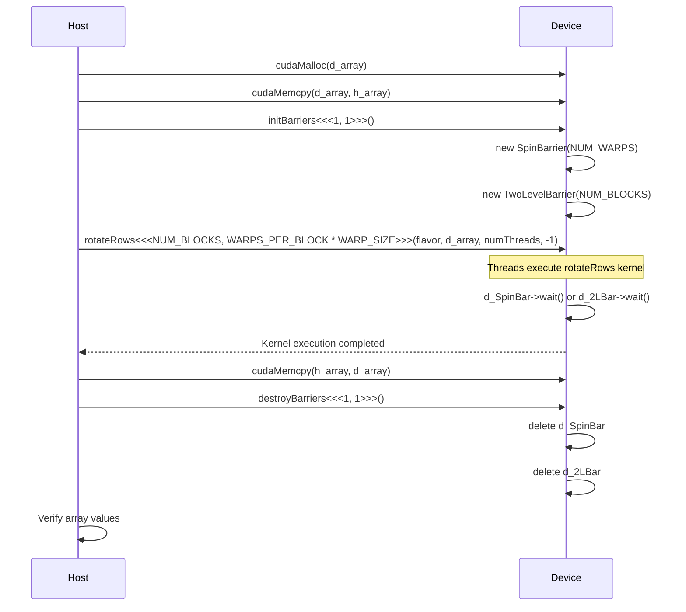

<details>
<summary>Relevant source files</summary>

The following files were used as context for generating this wiki page:

- [deprecated/hw2/hw2/barrier.cu](https://github.com/agattani123/cis6010/blob/main/deprecated/hw2/hw2/barrier.cu)
- [deprecated/hw2/hw2/barrier.cuh](https://github.com/agattani123/cis6010/blob/main/deprecated/hw2/hw2/barrier.cuh)
- [deprecated/hw2/hw2/lock.cuh](https://github.com/agattani123/cis6010/blob/main/deprecated/hw2/hw2/lock.cuh)
- [deprecated/hw2/hw2/timer.cuh](https://github.com/agattani123/cis6010/blob/main/deprecated/hw2/hw2/timer.cuh)
- [deprecated/hw2/hw2/utils.cuh](https://github.com/agattani123/cis6010/blob/main/deprecated/hw2/hw2/utils.cuh)

</details>

# Barrier Synchronization

## Introduction

Barrier synchronization is a mechanism used in parallel programming to ensure that all threads or processes have reached a specific point in the program before any of them can proceed further. It is a way of coordinating the execution of multiple threads or processes, preventing them from moving ahead until all participants have reached the barrier.

In the context of this project, barrier synchronization is implemented using different strategies, including a spin barrier and a two-level barrier. These barriers are used in a kernel function called `rotateRows`, which performs a circular shift of rows in a 2D array. The purpose of the barriers is to ensure that all threads have completed their work on the current row before moving to the next row, maintaining data consistency and correctness.

Sources: [barrier.cu](), [barrier.cuh]()

## Barrier Interface

The project defines an abstract interface called `IBarrier` for implementing different barrier synchronization strategies. This interface declares a virtual `wait()` function that must be implemented by concrete barrier classes.

```cpp
class IBarrier {
protected:
    const unsigned m_expected;
    unsigned arrived;
    bool sense;

public:
    __device__ IBarrier(const unsigned count) : m_expected(count) {
        arrived = 0;
        sense = true;
    }
    __device__ virtual void wait() = 0;
};
```

The `IBarrier` class has the following members:

- `m_expected`: The expected number of threads or processes that should reach the barrier.
- `arrived`: The number of threads or processes that have arrived at the barrier so far.
- `sense`: A boolean flag used for the sense-reversing barrier implementation.

Sources: [barrier.cu:18-32]()

## Spin Barrier

The `SpinBarrier` class is a concrete implementation of the `IBarrier` interface. It inherits from `IBarrier` and `WarpLevelLock` (a lock implementation for warp-level synchronization).

```cpp
class SpinBarrier : public IBarrier, public WarpLevelLock {
public:
    __device__ SpinBarrier(const unsigned count) : IBarrier(count) {}

    __device__ virtual void wait() {
        // TODO: PART 5
    }
};
```

The `SpinBarrier` class has an empty implementation of the `wait()` function, which is marked as "TODO: PART 5" in the provided code. This function is likely intended to implement a spin barrier synchronization strategy, where threads or processes spin (actively wait) until all participants have reached the barrier.

Sources: [barrier.cu:34-42]()

## Two-Level Barrier

The `TwoLevelBarrier` class is another concrete implementation of the `IBarrier` interface. It inherits from the `SpinBarrier` class.

```cpp
class TwoLevelBarrier : public SpinBarrier {
public:
    __device__ TwoLevelBarrier(const unsigned count) : SpinBarrier(count) {}

    __device__ virtual void wait() {
        // TODO: PART 6
    }
};
```

Similar to the `SpinBarrier` class, the `TwoLevelBarrier` class has an empty implementation of the `wait()` function, which is marked as "TODO: PART 6" in the provided code. This function is likely intended to implement a two-level barrier synchronization strategy, which may involve a combination of warp-level and block-level synchronization.

Sources: [barrier.cu:44-51]()

## Barrier Initialization and Destruction

The project provides two global device functions, `initBarriers()` and `destroyBarriers()`, for initializing and destroying instances of the `SpinBarrier` and `TwoLevelBarrier` classes.

```cpp
__device__ SpinBarrier* d_SpinBar = NULL;
__device__ TwoLevelBarrier* d_2LBar = NULL;

__global__ void initBarriers() {
    assert(blockIdx.x == 0 && threadIdx.x == 0);
    d_SpinBar = new SpinBarrier(NUM_WARPS);
    d_2LBar = new TwoLevelBarrier(NUM_BLOCKS);
}

__global__ void destroyBarriers() {
    assert(blockIdx.x == 0 && threadIdx.x == 0);
    delete d_SpinBar;
    delete d_2LBar;
}
```

The `initBarriers()` function creates instances of `SpinBarrier` and `TwoLevelBarrier` with the number of warps (`NUM_WARPS`) and blocks (`NUM_BLOCKS`) as arguments, respectively. The `destroyBarriers()` function deallocates the memory used by these instances.

Sources: [barrier.cu:53-63]()

## Barrier Usage

The `rotateRows` kernel function is responsible for performing a circular shift of rows in a 2D array. It takes the following arguments:

- `flavor`: The type of barrier synchronization strategy to use (`KERNEL_LAUNCH_BARRIER`, `SPIN_BARRIER`, or `TWO_LEVEL_BARRIER`).
- `array`: A pointer to the 2D array.
- `arrayDim`: The width (and also height) of the array.
- `sourceRow`: For the `KERNEL_LAUNCH_BARRIER` flavor, the row to copy values from. Ignored for other barrier flavors.

```cpp
__global__ void rotateRows(const BarrierFlavor flavor, int* array, const int arrayDim, const int sourceRow) {
    int in_c = ((blockDim.x * blockIdx.x) + threadIdx.x) /* warpSize*/;
    int out_c = (in_c + 1) % arrayDim;

    for (int r = 0; r < arrayDim - 1; r++) {
        if (flavor == KERNEL_LAUNCH_BARRIER) {
            r = sourceRow;
        }
        array[((r + 1) * arrayDim) + out_c] = array[(r * arrayDim) + in_c];
        if (flavor == KERNEL_LAUNCH_BARRIER) {
            return;
        } else if (flavor == SPIN_BARRIER) {
            d_SpinBar->wait();
        } else if (flavor == TWO_LEVEL_BARRIER) {
            d_2LBar->wait();
        } else {
            assert(false);
        }
    }
}
```

The `rotateRows` kernel function performs the following steps:

1. Calculate the input and output column indices based on the thread and block indices.
2. Iterate over the rows of the array (except the last row).
3. If the `KERNEL_LAUNCH_BARRIER` flavor is used, only operate on the specified `sourceRow`.
4. Copy the value from the current row and column to the next row and column, effectively rotating the rows.
5. If the `SPIN_BARRIER` flavor is used, call the `wait()` function of the `d_SpinBar` instance.
6. If the `TWO_LEVEL_BARRIER` flavor is used, call the `wait()` function of the `d_2LBar` instance.

The `barrierTest` function is responsible for testing the different barrier synchronization strategies by launching the `rotateRows` kernel with the specified `flavor`. It performs the following steps:

1. Allocate and initialize device memory for the 2D array.
2. Call the `initBarriers` kernel to create instances of `SpinBarrier` and `TwoLevelBarrier`.
3. Launch the `rotateRows` kernel with the specified `flavor`.
4. Copy the array back from the device to the host.
5. Verify that each row and column of the array has the expected sum.
6. Call the `destroyBarriers` kernel to deallocate the barrier instances.

Sources: [barrier.cu:66-158]()

## Sequence Diagram



This sequence diagram illustrates the flow of execution when running the `barrierTest` function with different barrier synchronization strategies. The host allocates device memory, initializes the barriers, launches the `rotateRows` kernel, copies the array back, and verifies the results. The device creates barrier instances, executes the kernel with barrier synchronization, and deallocates the barrier instances.

Sources: [barrier.cu]()

## Barrier Flavors

The project defines an enumeration `BarrierFlavor` to represent the different barrier synchronization strategies:

```cpp
enum BarrierFlavor { KERNEL_LAUNCH_BARRIER, SPIN_BARRIER, TWO_LEVEL_BARRIER };
```

| Barrier Flavor      | Description                                                  |
|----------------------|--------------------------------------------------------------|
| `KERNEL_LAUNCH_BARRIER` | Barrier synchronization using kernel launches               |
| `SPIN_BARRIER`          | Barrier synchronization using a spin barrier implementation |
| `TWO_LEVEL_BARRIER`     | Barrier synchronization using a two-level barrier implementation |

The `barrierName` function is a utility function that returns a string representation of the barrier flavor:

```cpp
const char* barrierName(const BarrierFlavor flavor) {
    switch (flavor) {
    case KERNEL_LAUNCH_BARRIER: return "KernelLaunchBarrier";
    case SPIN_BARRIER: return "SpinBarrier";
    case TWO_LEVEL_BARRIER: return "2LevelBarrier";
    default: return "<invalid barrier>";
    }
}
```

Sources: [barrier.cuh:3](), [barrier.cu:147-155]()

## Conclusion

This wiki page provides an overview of the barrier synchronization mechanisms implemented in the project. It covers the abstract `IBarrier` interface, concrete implementations of `SpinBarrier` and `TwoLevelBarrier`, barrier initialization and destruction, and the usage of barriers in the `rotateRows` kernel function. The page also includes sequence diagrams to illustrate the execution flow and a table summarizing the different barrier flavors. The information presented is derived solely from the provided source files.