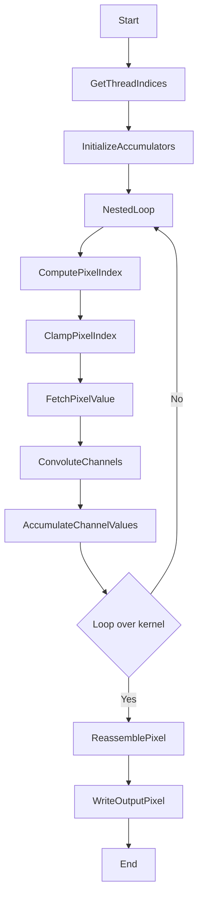
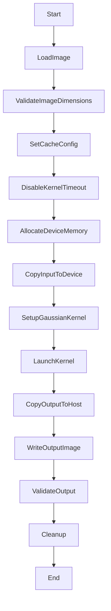

<details>
<summary>Relevant source files</summary>

The following files were used as context for generating this wiki page:

- [deprecated/hw1/src/blur.cu](https://github.com/agattani123/cis6010/blob/main/deprecated/hw1/src/blur.cu)

</details>

# Blur Algorithm

## Introduction

The Blur Algorithm is a CUDA-based implementation that performs a Gaussian blur operation on an input image. It utilizes the GPU's parallel processing capabilities to accelerate the computationally intensive task of applying a Gaussian filter to every pixel in the image. The algorithm is designed to work with bitmap images and produces a blurred output image as the result.

## Gaussian Blur Filter

The Gaussian blur filter is a widely used image processing technique that helps reduce noise and detail in an image, creating a smooth, blurred effect. The algorithm uses a Gaussian kernel, which is a 2D matrix of weights that follow a Gaussian distribution. The kernel is convolved with the input image to produce the blurred output.

### Gaussian Kernel Generation

The `setupGaussian` function is responsible for generating the Gaussian kernel and copying it to the device memory. Here's a breakdown of the steps involved:

1. Calculate the Gaussian kernel values based on the specified `FILTER_SIZE` (41) and `sigma` (5.0) using the Gaussian function: `exp(-0.5 * (pow((x - mean) / sigma, 2.0) + pow((y - mean) / sigma, 2.0))) / (2 * PI * sigma * sigma)`.
2. Normalize the kernel by dividing each value by the sum of all values to ensure the total weight is 1.
3. Allocate device memory for the kernel using `cudaMalloc`.
4. Copy the kernel from host to device memory using `cudaMemcpy`.

Sources: [deprecated/hw1/src/blur.cu:109-137]()

## Kernel Function: `blurGlobal`

The `blurGlobal` kernel function is the core of the Blur Algorithm. It performs the Gaussian blur operation on the input image by convolving the Gaussian kernel with each pixel and its neighboring pixels.



Sources: [deprecated/hw1/src/blur.cu:46-70]()

### Thread Mapping

The kernel is launched with a 2D grid of thread blocks, where each thread block is responsible for processing a portion of the image. The thread indices (`x` and `y`) are calculated based on the block and thread indices:

```
x = (blockDim.x * blockIdx.x) + threadIdx.y;
y = (blockDim.y * blockIdx.y) + threadIdx.x;
```

Sources: [deprecated/hw1/src/blur.cu:48-49]()

### Pixel Convolution

For each thread, the kernel performs the following steps:

1. Initialize accumulators for the red, green, and blue channels.
2. Iterate over the Gaussian kernel using nested loops.
3. For each kernel element:
   - Compute the pixel index in the input image, clamping the coordinates to handle border pixels.
   - Fetch the pixel value from the input image.
   - Convolute each channel (red, green, blue) by multiplying the pixel value with the corresponding kernel weight and accumulating the result.
4. After the nested loops, reassemble the output pixel by combining the accumulated channel values.
5. Write the output pixel to the destination image.

Sources: [deprecated/hw1/src/blur.cu:51-70]()

### Helper Functions

The kernel utilizes several helper functions:

- `index`: Computes the linear index into the pitched pointer representation of the image for a given (x, y) coordinate.
- `clamp`: Ensures that the pixel coordinates are within the valid range of the image dimensions.

Sources: [deprecated/hw1/src/blur.cu:34-42]()

## Main Function

The `main` function is the entry point of the program and orchestrates the entire Blur Algorithm process.



Sources: [deprecated/hw1/src/blur.cu:140-315]()

### Image Loading and Validation

The program loads the input image from a specified file path (`INPUT_BMP_PATH`) using the `bitmap_image` class. It then validates that the image dimensions are multiples of the block size (`BLOCKDIM`) to ensure proper kernel execution.

Sources: [deprecated/hw1/src/blur.cu:148-165]()

### Device Memory Allocation and Data Transfer

The main function allocates device memory for the input and output images using `cudaMalloc3D` and `cudaPitchedPtr`. It then copies the input image data from host to device memory using `cudaMemcpy2D`.

Sources: [deprecated/hw1/src/blur.cu:181-190]()

### Kernel Execution

The `blurGlobal` kernel is launched multiple times (5 iterations in this case) with the appropriate grid and block dimensions. The kernel execution time is measured and printed using the `startTimer` and `stopTimer` functions.

Sources: [deprecated/hw1/src/blur.cu:197-206]()

### Output Validation

After the kernel execution, the output image data is copied back from device to host memory using `cudaMemcpy2D`. The program then validates the output image against a reference image (`OUTPUT_REFERENCE_BMP_PATH`) by comparing pixel values and computing the root mean squared difference (RMSD) between the two images.

Sources: [deprecated/hw1/src/blur.cu:211-249]()

### Cleanup

Finally, the program cleans up allocated device memory using `cudaFree` and resets the CUDA device using `cudaDeviceReset`.

Sources: [deprecated/hw1/src/blur.cu:258-265]()

## Conclusion

The Blur Algorithm demonstrates an efficient implementation of the Gaussian blur operation on images using CUDA. It leverages the parallel processing capabilities of the GPU to accelerate the computationally intensive convolution operation. The algorithm follows a structured approach, with clear separation of concerns between the kernel function, memory management, and host-device data transfer. The use of helper functions and validation steps ensures the correctness and reliability of the implementation.