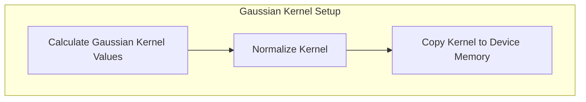
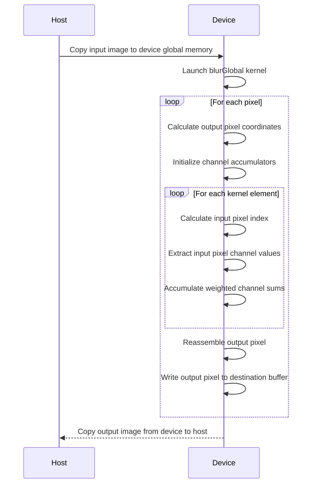

Relevant source files

The following files were used as context for generating this wiki page:

- [deprecated/hw1/src/blur.cu](https://github.com/agattani123/cis6010/blob/main/deprecated/hw1/src/blur.cu)

# Image Blur

## Introduction

The "Image Blur" functionality is a key component of this project, responsible for applying a Gaussian blur filter to input images. It utilizes CUDA to leverage the parallel computing capabilities of GPUs, enabling efficient processing of large image data. This feature is likely part of a larger image processing pipeline or application.

## Gaussian Blur Filter

The Gaussian blur filter is implemented using a fixed-size kernel of `FILTER_SIZE` (41 in this case). The kernel values are computed based on a Gaussian function with a specified sigma value (5.0 in this implementation). The kernel is normalized to ensure the sum of its values is 1.0.

Sources: [deprecated/hw1/src/blur.cu:119-141]()

## Image Loading and Preprocessing

The input image is loaded from a specified BMP file path (`INPUT_BMP_PATH`). The image dimensions are checked to ensure they are multiples of the block size (`BLOCKDIM`), which is set to 32. The image data is then copied to a host buffer (`h_buf`) in a pixel format of 32-bit integers, with each channel (red, green, blue) occupying 8 bits.

Sources: [deprecated/hw1/src/blur.cu:168-193]()

## Device Memory Allocation and Copying

The image data from the host buffer (`h_buf`) is copied to device global memory using `cudaMalloc3D` and `cudaMemcpy2D`. Two separate device buffers (`d_src` and `d_dst`) are allocated, one for the input image and one for the output blurred image. The device memory is initialized with the input image data and zeroed out for the output buffer.

Sources: [deprecated/hw1/src/blur.cu:207-217]()

## Kernel Execution

The `blurGlobal` kernel is launched with a grid and block configuration based on the image dimensions. Each thread processes a single pixel by convolving it with the Gaussian kernel. The kernel performs the following steps:

1. Calculate the output pixel coordinates (`x`, `y`) based on the block and thread indices.
2. Initialize accumulators for the red, green, and blue channels.
3. Iterate over the Gaussian kernel:
   - Calculate the input pixel index, clamping to handle border pixels.
   - Extract the red, green, and blue channel values from the input pixel.
   - Accumulate the weighted sum of each channel using the corresponding kernel value.
4. Reassemble the output pixel by combining the accumulated channel values.
5. Write the output pixel to the destination buffer.

Sources: [deprecated/hw1/src/blur.cu:43-73](), [deprecated/hw1/src/blur.cu:228-234]()

## Kernel Timing and Validation

The kernel execution time is measured and printed for 5 iterations using CUDA events. After the kernel execution, the output image data is copied back from the device to the host buffer (`h_buf`).

The output image is then validated against a reference image (`OUTPUT_REFERENCE_BMP_PATH`) by comparing pixel values. The number of differing pixels and the root mean square deviation (RMSD) of the pixel RGB values are calculated and reported.

Sources: [deprecated/hw1/src/blur.cu:82-95](), [deprecated/hw1/src/blur.cu:220-226](), [deprecated/hw1/src/blur.cu:238-275]()

## Cleanup

Finally, the allocated device memory is freed, and the CUDA device is reset to release any remaining resources.

Sources: [deprecated/hw1/src/blur.cu:285-292]()

In summary, the "Image Blur" feature applies a Gaussian blur filter to input images using CUDA-accelerated parallel processing. It involves loading the input image, setting up the Gaussian kernel, allocating device memory, launching the `blurGlobal` kernel to perform the convolution, and validating the output against a reference image. The blurred image is then saved to a specified output file path.