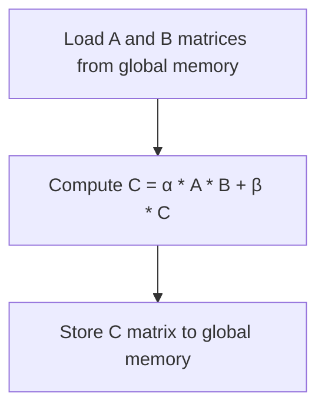
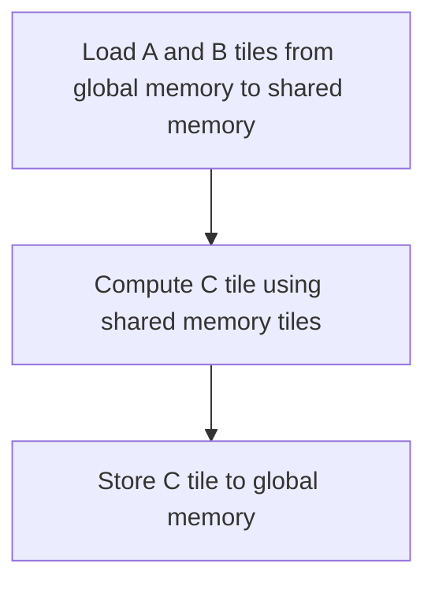
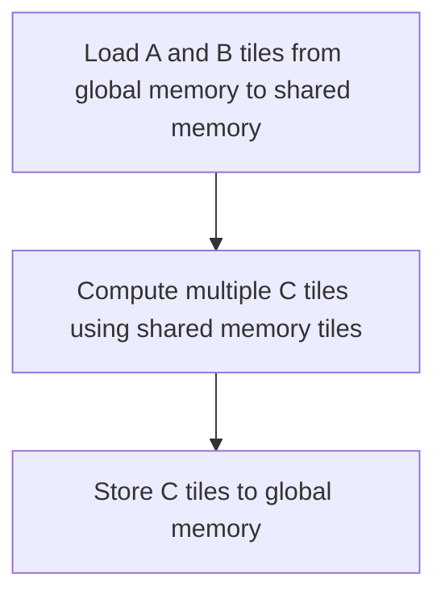
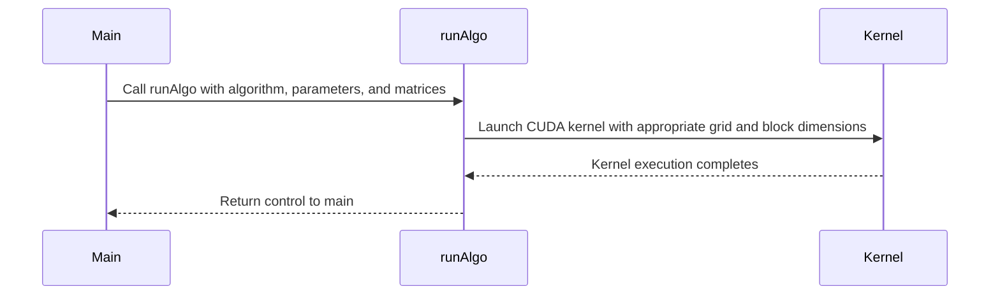
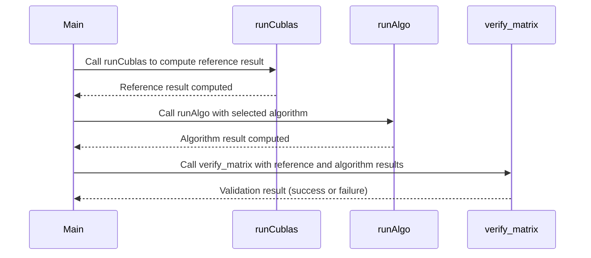
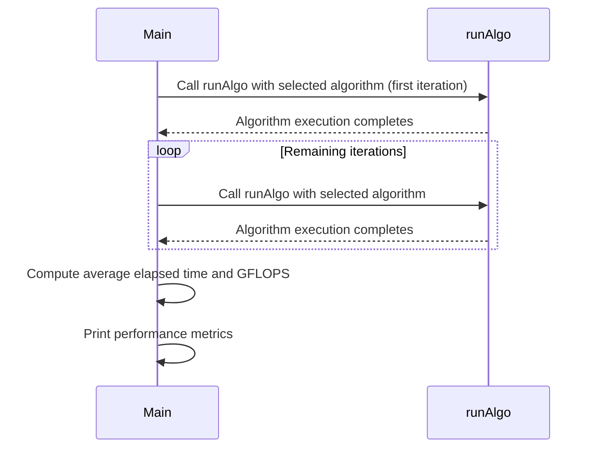

Relevant source files

The following files were used as context for generating this wiki page:

- [gemm/cugemm.cu](https://github.com/agattani123/cis6010/blob/main/gemm/cugemm.cu)

# Matrix Multiplication (GEMM)

## Introduction

The General Matrix Multiplication (GEMM) is a fundamental operation in linear algebra and is widely used in various scientific and engineering applications, such as machine learning, signal processing, and computational physics. This wiki page covers the implementation of GEMM in the context of the provided CUDA project, which aims to perform efficient matrix multiplication on GPUs.

The GEMM operation computes the matrix product `C = α * A * B + β * C`, where `A`, `B`, and `C` are matrices, and `α` and `β` are scalar values. The project provides several CUDA kernel implementations for GEMM, each optimized for different scenarios and performance characteristics.

Sources: [gemm/cugemm.cu](https://github.com/agattani123/cis6010/blob/main/gemm/cugemm.cu)

## GEMM Algorithms

The project implements the following GEMM algorithms:

### 1. cuBLAS

This algorithm uses the NVIDIA cuBLAS library, which provides highly optimized GEMM implementations for various matrix sizes and GPU architectures.

Sources: [gemm/cugemm.cu:167-171](https://github.com/agattani123/cis6010/blob/main/gemm/cugemm.cu#L167-L171)

### 2. Basic

The basic GEMM implementation is a straightforward CUDA kernel that computes the matrix multiplication using a nested loop. Each thread computes a single element of the output matrix `C`.

Sources: [gemm/cugemm.cu:175-188](https://github.com/agattani123/cis6010/blob/main/gemm/cugemm.cu#L175-L188)

### 3. Global Memory Coalesced

This algorithm aims to improve the basic implementation by coalescing global memory accesses to improve performance.

Sources: [gemm/cugemm.cu:191-194](https://github.com/agattani123/cis6010/blob/main/gemm/cugemm.cu#L191-L194)

### 4. Shared Memory

The shared memory implementation uses shared memory to cache tiles of the input matrices `A` and `B` to reduce global memory accesses and improve performance.

Sources: [gemm/cugemm.cu:200-215](https://github.com/agattani123/cis6010/blob/main/gemm/cugemm.cu#L200-L215)

### 5. Shared Memory Multi-Output

This algorithm extends the shared memory implementation by having each thread compute multiple output elements of `C` to increase the computational intensity and improve performance.

Sources: [gemm/cugemm.cu:221-236](https://github.com/agattani123/cis6010/blob/main/gemm/cugemm.cu#L221-L236)

## GEMM Kernel Execution

The `runAlgo` function is responsible for executing the selected GEMM algorithm based on the provided parameters.

The function sets up the appropriate grid and block dimensions for the selected algorithm and launches the corresponding CUDA kernel.

Sources: [gemm/cugemm.cu:271-317](https://github.com/agattani123/cis6010/blob/main/gemm/cugemm.cu#L271-L317)

## Validation and Performance Measurement

The project includes functionality to validate the GEMM results against the cuBLAS implementation and measure the performance of the selected algorithm.

### Validation

The `verify_matrix` function compares the output matrix `C` with the expected result computed by the cuBLAS implementation. If a discrepancy is found, the function logs the faulty output to a file (`gemmValidationFailure.txt`) for further analysis.

Sources: [gemm/cugemm.cu:115-163](https://github.com/agattani123/cis6010/blob/main/gemm/cugemm.cu#L115-L163), [gemm/cugemm.cu:167-171](https://github.com/agattani123/cis6010/blob/main/gemm/cugemm.cu#L167-L171), [gemm/cugemm.cu:271-317](https://github.com/agattani123/cis6010/blob/main/gemm/cugemm.cu#L271-L317)

### Performance Measurement

The project measures the execution time of the selected GEMM algorithm using CUDA events. The average elapsed time and GFLOPS (Giga Floating-Point Operations per Second) performance are reported for the specified number of repetitions.

Sources: [gemm/cugemm.cu:81-108](https://github.com/agattani123/cis6010/blob/main/gemm/cugemm.cu#L81-L108)

## Conclusion

The provided project implements various GEMM algorithms for efficient matrix multiplication on GPUs. It includes a basic implementation, optimizations using coalesced global memory accesses, shared memory tiling, and a multi-output shared memory approach. The project also includes functionality for validating the results against the cuBLAS library and measuring the performance of the selected algorithm.

Sources: [gemm/cugemm.cu](https://github.com/agattani123/cis6010/blob/main/gemm/cugemm.cu)