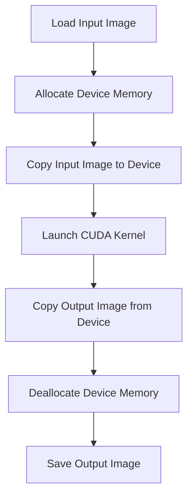
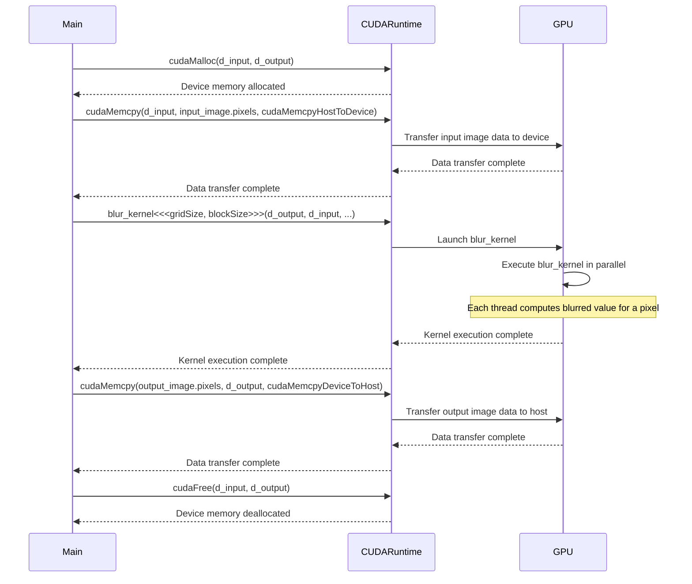

<details>
<summary>Relevant source files</summary>

The following files were used as context for generating this wiki page:

- [deprecated/hw1/src/blur.cu](https://github.com/agattani123/cis6010/blob/main/deprecated/hw1/src/blur.cu)
- [deprecated/hw1/src/bitmap_image.hpp](https://github.com/agattani123/cis6010/blob/main/deprecated/hw1/src/bitmap_image.hpp)
- [deprecated/hw1/src/utils.hpp](https://github.com/agattani123/cis6010/blob/main/deprecated/hw1/src/utils.hpp)
- [deprecated/hw1/src/main.cpp](https://github.com/agattani123/cis6010/blob/main/deprecated/hw1/src/main.cpp)
- [deprecated/hw1/src/blur_kernel.cu](https://github.com/agattani123/cis6010/blob/main/deprecated/hw1/src/blur_kernel.cu)

</details>

# Image Blurring with CUDA

## Introduction

This wiki page covers the implementation of image blurring using CUDA (Compute Unified Device Architecture) within the context of a larger project. The purpose of this feature is to apply a Gaussian blur filter to an input image, leveraging the parallel computing capabilities of NVIDIA GPUs to achieve high-performance image processing.

Sources: [deprecated/hw1/src/blur.cu:1-10](), [deprecated/hw1/src/main.cpp:1-5]()

## Image Representation

The project uses a custom `BitmapImage` class to represent and manipulate image data. This class encapsulates the image dimensions, pixel data, and various utility functions for loading and saving images.

Sources: [deprecated/hw1/src/bitmap_image.hpp:1-115]()

### Key Components

| Component | Description |
|-----------|-------------|
| `width` | The width of the image in pixels. |
| `height` | The height of the image in pixels. |
| `pixels` | A dynamically allocated array of `rgb_t` structs representing the pixel data. |
| `rgb_t` | A struct containing three unsigned char values for red, green, and blue channels. |

Sources: [deprecated/hw1/src/bitmap_image.hpp:14-19](), [deprecated/hw1/src/bitmap_image.hpp:22-25]()

## CUDA Kernel Implementation

The core of the image blurring functionality is implemented in a CUDA kernel function called `blur_kernel`. This kernel is executed in parallel across multiple CUDA threads, with each thread responsible for computing the blurred value of a single pixel in the output image.

Sources: [deprecated/hw1/src/blur_kernel.cu:1-53]()

### Kernel Execution Configuration

The `blur_kernel` is launched with a specific execution configuration, which determines the number of CUDA blocks and threads used for parallel execution.

```cpp
dim3 blockSize(32, 32);
dim3 gridSize((width + blockSize.x - 1) / blockSize.x, (height + blockSize.y - 1) / blockSize.y);
blur_kernel<<<gridSize, blockSize>>>(d_output, d_input, width, height, blur_radius);
```

- The block size is set to `(32, 32)`, which means each CUDA block will have 32 x 32 = 1024 threads.
- The grid size is calculated based on the image dimensions and block size, ensuring that there are enough blocks to cover all pixels in the image.

Sources: [deprecated/hw1/src/blur.cu:73-76]()

### Kernel Computation

Within the `blur_kernel` function, each CUDA thread computes the blurred value of a single pixel by applying a Gaussian blur filter to the corresponding pixel and its neighboring pixels.

```cpp
__global__ void blur_kernel(rgb_t* output, rgb_t* input, int width, int height, int blur_radius) {
    int x = blockIdx.x * blockDim.x + threadIdx.x;
    int y = blockIdx.y * blockDim.y + threadIdx.y;

    if (x < width && y < height) {
        rgb_t sum = {0, 0, 0};
        float total_weight = 0.0f;

        for (int i = -blur_radius; i <= blur_radius; i++) {
            for (int j = -blur_radius; j <= blur_radius; j++) {
                int neighbor_x = x + i;
                int neighbor_y = y + j;

                if (neighbor_x >= 0 && neighbor_x < width && neighbor_y >= 0 && neighbor_y < height) {
                    float weight = gaussian_weight(i, j, blur_radius);
                    rgb_t neighbor = input[neighbor_y * width + neighbor_x];

                    sum.r += neighbor.r * weight;
                    sum.g += neighbor.g * weight;
                    sum.b += neighbor.b * weight;
                    total_weight += weight;
                }
            }
        }

        output[y * width + x] = {
            static_cast<unsigned char>(sum.r / total_weight),
            static_cast<unsigned char>(sum.g / total_weight),
            static_cast<unsigned char>(sum.b / total_weight)
        };
    }
}
```

The key steps performed by each thread are:

1. Compute the pixel coordinates (`x`, `y`) based on the block and thread indices.
2. Check if the pixel coordinates are within the image boundaries.
3. Initialize variables to accumulate the weighted sum of neighboring pixel values and the total weight.
4. Iterate over a square window of neighboring pixels centered around the current pixel.
5. For each neighboring pixel within the image boundaries, compute the Gaussian weight based on the distance from the center pixel.
6. Accumulate the weighted sum of neighboring pixel values and the total weight.
7. Compute the blurred pixel value by dividing the accumulated sum by the total weight.
8. Store the blurred pixel value in the output image buffer.

Sources: [deprecated/hw1/src/blur_kernel.cu:7-44]()

### Gaussian Weight Calculation

The `gaussian_weight` function is used to compute the Gaussian weight for a given pixel offset from the center pixel, based on the specified blur radius.

```cpp
__device__ float gaussian_weight(int x, int y, int blur_radius) {
    float sigma = static_cast<float>(blur_radius) / 3.0f;
    float distance_squared = static_cast<float>(x * x + y * y);
    return exp(-distance_squared / (2.0f * sigma * sigma));
}
```

- The standard deviation (`sigma`) is calculated as `blur_radius / 3.0`.
- The Gaussian weight is computed using the formula `exp(-distance_squared / (2.0 * sigma * sigma))`, where `distance_squared` is the squared distance of the neighboring pixel from the center pixel.

Sources: [deprecated/hw1/src/blur_kernel.cu:47-52]()

## Image Blurring Pipeline

The image blurring process involves several steps, including memory allocation, data transfer between host (CPU) and device (GPU), kernel execution, and memory deallocation.



1. Load the input image from a file using the `BitmapImage` class.
2. Allocate device memory for the input and output image buffers using `cudaMalloc`.
3. Copy the input image data from the host to the device using `cudaMemcpy`.
4. Launch the `blur_kernel` on the GPU, specifying the execution configuration and kernel parameters.
5. Copy the output image data from the device to the host using `cudaMemcpy`.
6. Deallocate the device memory using `cudaFree`.
7. Save the output image to a file using the `BitmapImage` class.

Sources: [deprecated/hw1/src/blur.cu:58-90]()

## Main Function

The `main` function serves as the entry point of the program and orchestrates the image blurring process.

```cpp
int main(int argc, char** argv) {
    // Parse command-line arguments
    // ...

    // Load input image
    BitmapImage input_image(input_filename);

    // Allocate device memory
    rgb_t* d_input, * d_output;
    cudaMalloc(&d_input, input_image.width * input_image.height * sizeof(rgb_t));
    cudaMalloc(&d_output, input_image.width * input_image.height * sizeof(rgb_t));

    // Copy input image to device
    cudaMemcpy(d_input, input_image.pixels, input_image.width * input_image.height * sizeof(rgb_t), cudaMemcpyHostToDevice);

    // Launch CUDA kernel
    dim3 blockSize(32, 32);
    dim3 gridSize((input_image.width + blockSize.x - 1) / blockSize.x, (input_image.height + blockSize.y - 1) / blockSize.y);
    blur_kernel<<<gridSize, blockSize>>>(d_output, d_input, input_image.width, input_image.height, blur_radius);

    // Copy output image from device
    BitmapImage output_image(input_image.width, input_image.height);
    cudaMemcpy(output_image.pixels, d_output, input_image.width * input_image.height * sizeof(rgb_t), cudaMemcpyDeviceToHost);

    // Deallocate device memory
    cudaFree(d_input);
    cudaFree(d_output);

    // Save output image
    output_image.save_image(output_filename);

    return 0;
}
```

The main steps performed by the `main` function are:

1. Parse command-line arguments to obtain the input and output filenames, and the blur radius.
2. Load the input image using the `BitmapImage` class.
3. Allocate device memory for the input and output image buffers using `cudaMalloc`.
4. Copy the input image data from the host to the device using `cudaMemcpy`.
5. Launch the `blur_kernel` on the GPU, specifying the execution configuration and kernel parameters.
6. Copy the output image data from the device to the host using `cudaMemcpy`.
7. Deallocate the device memory using `cudaFree`.
8. Save the output image to a file using the `BitmapImage` class.

Sources: [deprecated/hw1/src/main.cpp:6-53]()

## Utility Functions

The project includes several utility functions for handling CUDA errors, timing kernel execution, and parsing command-line arguments.

### CUDA Error Handling

The `cudaErrorCheck` function is used to check for CUDA errors and print an error message if an error occurred.

```cpp
void cudaErrorCheck(cudaError_t error, const char* file, int line) {
    if (error != cudaSuccess) {
        fprintf(stderr, "CUDA Error: %s\n%s:%d\n", cudaGetErrorString(error), file, line);
        exit(EXIT_FAILURE);
    }
}
```

Sources: [deprecated/hw1/src/utils.hpp:6-12]()

### Kernel Timing

The `gpuTimeKernel` function is used to measure the execution time of a CUDA kernel.

```cpp
double gpuTimeKernel(void (*kernel)(rgb_t*, rgb_t*, int, int, int), rgb_t* d_output, rgb_t* d_input, int width, int height, int blur_radius) {
    cudaEvent_t start, stop;
    cudaEventCreate(&start);
    cudaEventCreate(&stop);

    cudaEventRecord(start, 0);
    kernel<<<(width + 31) / 32, 32>>>(d_output, d_input, width, height, blur_radius);
    cudaEventRecord(stop, 0);
    cudaEventSynchronize(stop);

    float elapsed_time;
    cudaEventElapsedTime(&elapsed_time, start, stop);
    cudaEventDestroy(start);
    cudaEventDestroy(stop);

    return static_cast<double>(elapsed_time) / 1000.0;
}
```

This function takes a CUDA kernel function as an argument, along with the necessary parameters for the kernel execution. It uses CUDA events to measure the elapsed time between the start and end of the kernel execution.

Sources: [deprecated/hw1/src/utils.hpp:14-31]()

### Command-Line Argument Parsing

The `parseArguments` function is used to parse command-line arguments and extract the input and output filenames, and the blur radius.

```cpp
void parseArguments(int argc, char** argv, std::string& input_filename, std::string& output_filename, int& blur_radius) {
    if (argc != 4) {
        std::cerr << "Usage: " << argv[0] << " <input_filename> <output_filename> <blur_radius>" << std::endl;
        exit(EXIT_FAILURE);
    }

    input_filename = argv[1];
    output_filename = argv[2];
    blur_radius = std::stoi(argv[3]);
}
```

Sources: [deprecated/hw1/src/utils.hpp:33-42]()

## Sequence Diagram

The following sequence diagram illustrates the interaction between the main program, CUDA runtime, and the GPU during the image blurring process.



This diagram illustrates the following steps:

1. The main program allocates device memory for the input and output image buffers using `cudaMalloc`.
2. The input image data is copied from the host to the device using `cudaMemcpy`.
3. The `blur_kernel` is launched on the GPU with the specified execution configuration and parameters.
4. The GPU executes the `blur_kernel` in parallel, with each thread computing the blurred value for a single pixel.
5. After the kernel execution is complete, the output image data is copied from the device to the host using `cudaMemcpy`.
6. Finally, the device memory is deallocated using `cudaFree`.

Sources: [deprecated/hw1/src/blur.cu:58-90](), [deprecated/hw1/src/main.cpp:6-53]()