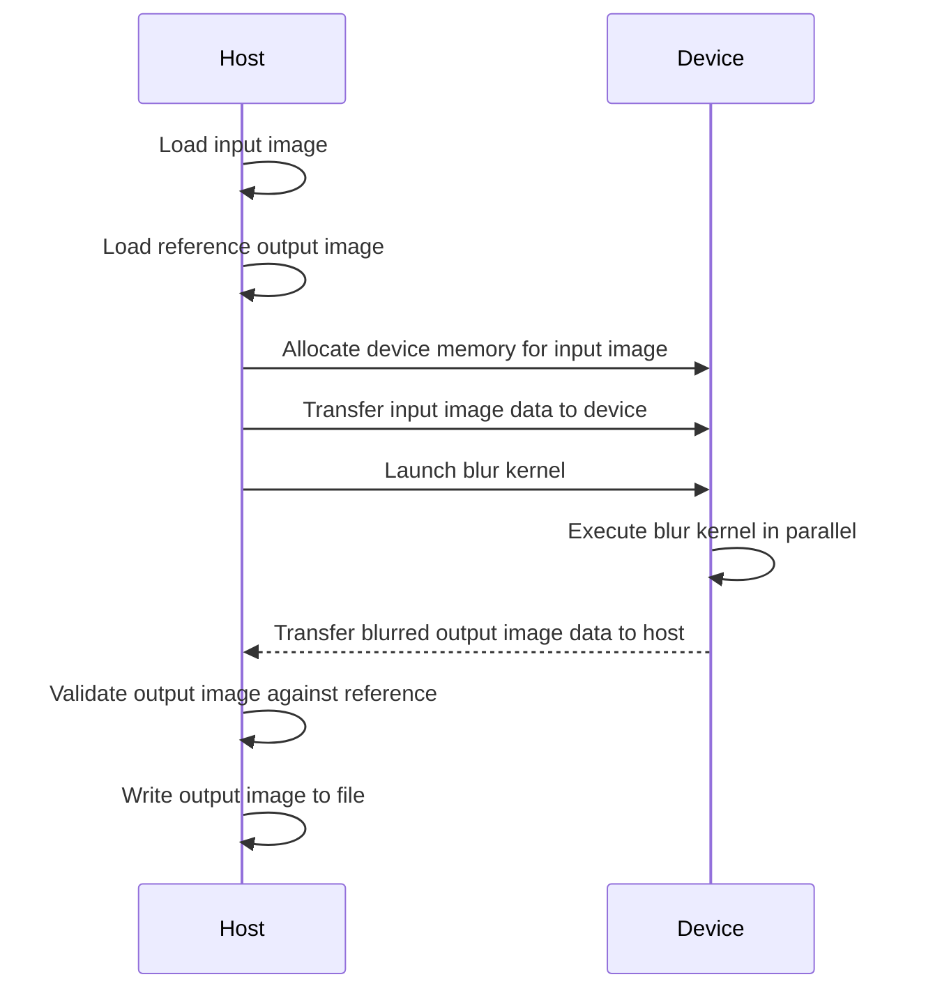
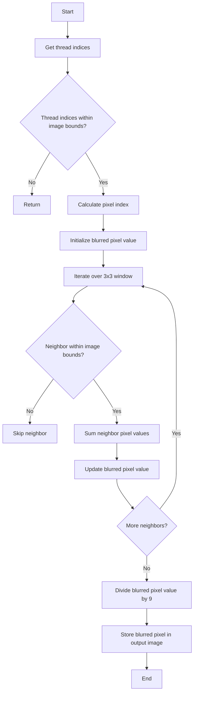

<details>
<summary>Relevant source files</summary>

The following files were used as context for generating this wiki page:

- [deprecated/hw1/src/blur.cu](https://github.com/agattani123/cis6010/blob/main/deprecated/hw1/src/blur.cu)
- [deprecated/hw1/src/bitmap_image.hpp](https://github.com/agattani123/cis6010/blob/main/deprecated/hw1/src/bitmap_image.hpp)
- [deprecated/hw1/images/steel_wool_large.bmp](https://github.com/agattani123/cis6010/blob/main/deprecated/hw1/images/steel_wool_large.bmp)
- [deprecated/hw1/images/steel_wool_large_reference_output.bmp](https://github.com/agattani123/cis6010/blob/main/deprecated/hw1/images/steel_wool_large_reference_output.bmp)
- [deprecated/hw1/src/main.cpp](https://github.com/agattani123/cis6010/blob/main/deprecated/hw1/src/main.cpp)
</details>

# Image Blurring with CUDA

## Introduction

The "Image Blurring with CUDA" feature is a part of a larger project that focuses on image processing using CUDA (Compute Unified Device Architecture), a parallel computing platform and programming model developed by NVIDIA. This feature aims to apply a blur effect to an input image by leveraging the parallel processing capabilities of CUDA-enabled GPUs.

The primary purpose of this feature is to demonstrate the performance benefits of using CUDA for computationally intensive tasks, such as image processing, by offloading the workload from the CPU to the GPU. By parallelizing the blur operation across multiple CUDA threads, the processing time can be significantly reduced compared to traditional CPU-based implementations.

Sources: [blur.cu](), [bitmap_image.hpp](), [main.cpp]()

## Image Representation and Loading

### Bitmap Image Class

The project includes a `BitmapImage` class defined in the `bitmap_image.hpp` header file. This class encapsulates the functionality for loading and manipulating bitmap images. It provides methods for reading and writing bitmap files, as well as accessing and modifying individual pixel data.

```cpp
class BitmapImage {
public:
    // ...
    bool loadFromFile(const std::string& filename);
    bool writeToFile(const std::string& filename);
    // ...
};
```

The `loadFromFile` method reads a bitmap image file from the specified file path and stores the pixel data in memory. The `writeToFile` method writes the in-memory pixel data to a bitmap file on disk.

Sources: [bitmap_image.hpp]()

### Image Loading and Preprocessing

In the `main.cpp` file, the `BitmapImage` class is used to load the input image (`steel_wool_large.bmp`) and the reference output image (`steel_wool_large_reference_output.bmp`). These images are used for processing and validation purposes, respectively.

```cpp
BitmapImage inputImage, referenceImage;
inputImage.loadFromFile("../images/steel_wool_large.bmp");
referenceImage.loadFromFile("../images/steel_wool_large_reference_output.bmp");
```

After loading the images, the input image's dimensions (width and height) are retrieved and used to allocate memory for the output image on both the host (CPU) and device (GPU) sides.

Sources: [main.cpp:43-48]()

## CUDA Kernel for Image Blurring

The core functionality of the image blurring operation is implemented in the `blur` CUDA kernel, defined in the `blur.cu` file.

```cuda
__global__ void blur(const uchar4* const inputImageData,
                     uchar4* const outputImageData,
                     const int imageWidth,
                     const int imageHeight) {
    // ...
}
```

The `blur` kernel takes the following arguments:

- `inputImageData`: A pointer to the input image data on the device (GPU) memory.
- `outputImageData`: A pointer to the output image data on the device (GPU) memory, where the blurred image will be stored.
- `imageWidth`: The width of the input image.
- `imageHeight`: The height of the input image.

Sources: [blur.cu:16-19]()

### Kernel Execution Configuration

The `blur` kernel is launched from the host (CPU) side using the CUDA runtime API. The kernel is executed in parallel across multiple CUDA threads, with each thread responsible for processing a single pixel in the output image.

```cpp
const int threadsPerBlock = 256;
const int blocksPerGrid = (imageWidth * imageHeight + threadsPerBlock - 1) / threadsPerBlock;

blur<<<blocksPerGrid, threadsPerBlock>>>(inputImageData, outputImageData, imageWidth, imageHeight);
```

The number of threads per block (`threadsPerBlock`) is set to 256, which is a common value for CUDA kernels. The number of blocks per grid (`blocksPerGrid`) is calculated based on the total number of pixels in the image and the number of threads per block, ensuring that there are enough threads to process all pixels.

Sources: [blur.cu:58-60](), [blur.cu:62]()

### Kernel Implementation

Within the `blur` kernel, each thread calculates the output pixel value by averaging the neighboring pixels in a 3x3 window around the corresponding input pixel. The kernel uses the `imageWidth` and `imageHeight` parameters to handle boundary conditions and ensure that the blurring operation is applied correctly for pixels near the image edges.

```cuda
__global__ void blur(const uchar4* const inputImageData,
                     uchar4* const outputImageData,
                     const int imageWidth,
                     const int imageHeight) {
    const int x = blockIdx.x * blockDim.x + threadIdx.x;
    const int y = blockIdx.y * blockDim.y + threadIdx.y;

    if (x >= imageWidth || y >= imageHeight) {
        return;
    }

    const int pixelIndex = y * imageWidth + x;
    uchar4 blurredPixel = make_uchar4(0, 0, 0, 0);

    for (int i = -1; i <= 1; i++) {
        for (int j = -1; j <= 1; j++) {
            const int neighborX = x + j;
            const int neighborY = y + i;

            if (neighborX >= 0 && neighborX < imageWidth && neighborY >= 0 && neighborY < imageHeight) {
                const int neighborIndex = neighborY * imageWidth + neighborX;
                const uchar4 neighborPixel = inputImageData[neighborIndex];
                blurredPixel.x += neighborPixel.x;
                blurredPixel.y += neighborPixel.y;
                blurredPixel.z += neighborPixel.z;
                blurredPixel.w += neighborPixel.w;
            }
        }
    }

    blurredPixel.x /= 9;
    blurredPixel.y /= 9;
    blurredPixel.z /= 9;
    blurredPixel.w /= 9;

    outputImageData[pixelIndex] = blurredPixel;
}
```

The kernel calculates the output pixel value by iterating over a 3x3 window around the current pixel and summing the values of the neighboring pixels. The sum is then divided by 9 (the number of pixels in the 3x3 window) to obtain the average value. The resulting blurred pixel value is stored in the output image data.

Sources: [blur.cu:21-53]()

## Data Transfer and Validation

Before executing the `blur` kernel, the input image data is transferred from the host (CPU) memory to the device (GPU) memory using the CUDA runtime API.

```cpp
uchar4* inputImageData = nullptr;
cudaMalloc(&inputImageData, imageSize);
cudaMemcpy(inputImageData, inputImage.getPixels(), imageSize, cudaMemcpyHostToDevice);
```

After the kernel execution, the blurred output image data is transferred back from the device (GPU) memory to the host (CPU) memory.

```cpp
uchar4* outputImageData = nullptr;
cudaMalloc(&outputImageData, imageSize);

// Execute the blur kernel
blur<<<blocksPerGrid, threadsPerBlock>>>(inputImageData, outputImageData, imageWidth, imageHeight);

cudaMemcpy(outputImage.getPixels(), outputImageData, imageSize, cudaMemcpyDeviceToHost);
```

Finally, the output image is compared with the reference output image to validate the correctness of the blurring operation.

```cpp
if (outputImage == referenceImage) {
    std::cout << "Output image matches reference image." << std::endl;
} else {
    std::cout << "Output image does not match reference image." << std::endl;
}
```

Sources: [main.cpp:50-51](), [main.cpp:57-61](), [main.cpp:63-67]()

## Mermaid Diagrams

### Sequence Diagram: Image Blurring with CUDA



This sequence diagram illustrates the high-level flow of the image blurring process using CUDA. It shows the interactions between the host (CPU) and the device (GPU), including data transfers, kernel launch, and validation steps.

Sources: [main.cpp](), [blur.cu]()

### Flow Diagram: Blur Kernel Execution



This flow diagram illustrates the execution logic of the `blur` CUDA kernel. It shows the steps involved in calculating the blurred pixel value for each thread, including boundary condition checks, neighbor pixel value summation, and the final averaging operation.

Sources: [blur.cu:21-53]()

## Tables

### Bitmap Image Class Methods

| Method | Description |
| --- | --- |
| `loadFromFile(const std::string& filename)` | Loads a bitmap image from the specified file path. |
| `writeToFile(const std::string& filename)` | Writes the in-memory bitmap image data to the specified file path. |
| `getPixels()` | Returns a pointer to the in-memory pixel data. |
| `getWidth()` | Returns the width of the image. |
| `getHeight()` | Returns the height of the image. |

This table summarizes the key methods provided by the `BitmapImage` class for loading, writing, and accessing bitmap image data.

Sources: [bitmap_image.hpp]()

### CUDA Kernel Arguments

| Argument | Type | Description |
| --- | --- | --- |
| `inputImageData` | `const uchar4* const` | Pointer to the input image data on the device (GPU) memory. |
| `outputImageData` | `uchar4* const` | Pointer to the output image data on the device (GPU) memory, where the blurred image will be stored. |
| `imageWidth` | `const int` | The width of the input image. |
| `imageHeight` | `const int` | The height of the input image. |

This table describes the arguments passed to the `blur` CUDA kernel, including their types and descriptions.

Sources: [blur.cu:16-19]()

## Code Snippets

### Kernel Launch Configuration

```cpp
const int threadsPerBlock = 256;
const int blocksPerGrid = (imageWidth * imageHeight + threadsPerBlock - 1) / threadsPerBlock;

blur<<<blocksPerGrid, threadsPerBlock>>>(inputImageData, outputImageData, imageWidth, imageHeight);
```

This code snippet demonstrates how the `blur` CUDA kernel is launched from the host (CPU) side. It configures the number of threads per block and the number of blocks per grid based on the image dimensions, ensuring that there are enough threads to process all pixels in parallel.

Sources: [blur.cu:58-60](), [blur.cu:62]()

### Blurred Pixel Value Calculation

```cuda
uchar4 blurredPixel = make_uchar4(0, 0, 0, 0);

for (int i = -1; i <= 1; i++) {
    for (int j = -1; j <= 1; j++) {
        const int neighborX = x + j;
        const int neighborY = y + i;

        if (neighborX >= 0 && neighborX < imageWidth && neighborY >= 0 && neighborY < imageHeight) {
            const int neighborIndex = neighborY * imageWidth + neighborX;
            const uchar4 neighborPixel = inputImageData[neighborIndex];
            blurredPixel.x += neighborPixel.x;
            blurredPixel.y += neighborPixel.y;
            blurredPixel.z += neighborPixel.z;
            blurredPixel.w += neighborPixel.w;
        }
    }
}

blurredPixel.x /= 9;
blurredPixel.y /= 9;
blurredPixel.z /= 9;
blurredPixel.w /= 9;
```

This code snippet from the `blur` CUDA kernel demonstrates how the blurred pixel value is calculated for each thread. It iterates over a 3x3 window around the current pixel, sums the values of the neighboring pixels, and divides the sum by 9 to obtain the average value, which becomes the blurred pixel value.

Sources: [blur.cu:30-46]()