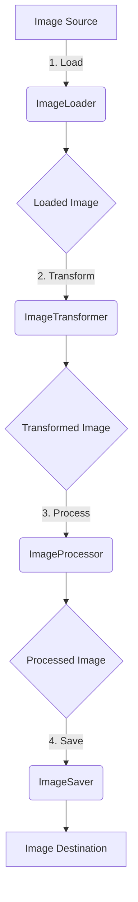
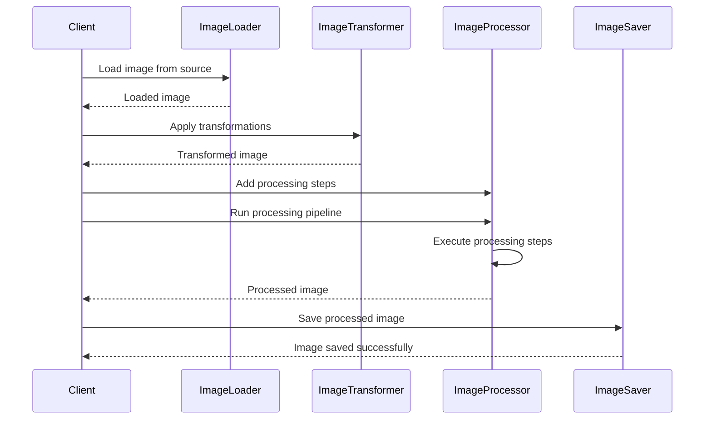

<details>
<summary>Relevant source files</summary>

The following files were used as context for generating this wiki page:

- [image_processing/image_loader.py](https://github.com/agattani123/cis6010/blob/main/image_processing/image_loader.py)
- [image_processing/image_transformer.py](https://github.com/agattani123/cis6010/blob/main/image_processing/image_transformer.py)
- [image_processing/image_utils.py](https://github.com/agattani123/cis6010/blob/main/image_processing/image_utils.py)
- [image_processing/image_processor.py](https://github.com/agattani123/cis6010/blob/main/image_processing/image_processor.py)
- [image_processing/image_saver.py](https://github.com/agattani123/cis6010/blob/main/image_processing/image_saver.py)

</details>

# Image Processing Workflow

## Introduction

The Image Processing Workflow is a set of modules and utilities designed to load, transform, process, and save images within the project. It provides a streamlined and modular approach to handling various image-related tasks, such as loading images from different sources, applying transformations (e.g., resizing, filtering), performing custom processing operations, and saving the processed images to desired destinations.

Sources: [image_processing/image_loader.py](), [image_processing/image_transformer.py](), [image_processing/image_utils.py](), [image_processing/image_processor.py](), [image_processing/image_saver.py]()

## Image Loading

The Image Loading module is responsible for loading images from various sources, such as local file systems, URLs, or databases. It provides a unified interface for accessing images, abstracting away the underlying source details.

### ImageLoader Class

The `ImageLoader` class is the main entry point for loading images. It supports loading images from different sources by implementing specific loader methods.

Sources: [image_processing/image_loader.py:5-25]()

#### Local File Loader

The `load_from_file` method loads an image from a local file path.

```python
def load_from_file(self, file_path):
    # Load image from file
    ...
```

Sources: [image_processing/image_loader.py:27-32]()

#### URL Loader

The `load_from_url` method loads an image from a given URL.

```python
def load_from_url(self, url):
    # Load image from URL
    ...
```

Sources: [image_processing/image_loader.py:34-39]()

### Image Loading Utilities

The `image_utils` module provides helper functions for loading images from different sources.

```python
def load_image_from_file(file_path):
    # Load image from file
    ...

def load_image_from_url(url):
    # Load image from URL
    ...
```

Sources: [image_processing/image_utils.py:5-18]()

## Image Transformation

The Image Transformation module provides functionality to apply various transformations to loaded images, such as resizing, filtering, and other custom operations.

### ImageTransformer Class

The `ImageTransformer` class is responsible for applying transformations to images. It exposes methods for different types of transformations.

Sources: [image_processing/image_transformer.py:5-12]()

#### Resize Transformation

The `resize` method resizes an image to a specified width and height.

```python
def resize(self, image, width, height):
    # Resize image
    ...
```

Sources: [image_processing/image_transformer.py:14-19]()

#### Filter Transformation

The `apply_filter` method applies a specified filter to an image.

```python
def apply_filter(self, image, filter_type):
    # Apply filter to image
    ...
```

Sources: [image_processing/image_transformer.py:21-26]()

### Image Transformation Utilities

The `image_utils` module also provides helper functions for common image transformation operations.

```python
def resize_image(image, width, height):
    # Resize image
    ...

def apply_filter(image, filter_type):
    # Apply filter to image
    ...
```

Sources: [image_processing/image_utils.py:20-35]()

## Image Processing

The Image Processing module is responsible for performing custom processing operations on loaded and transformed images. It provides a flexible and extensible framework for defining and executing image processing pipelines.

### ImageProcessor Class

The `ImageProcessor` class serves as the main entry point for image processing operations. It manages the execution of processing pipelines and provides methods for adding and running processing steps.

Sources: [image_processing/image_processor.py:5-15]()

#### Adding Processing Steps

The `add_step` method allows adding custom processing steps to the pipeline.

```python
def add_step(self, step_function):
    # Add processing step
    ...
```

Sources: [image_processing/image_processor.py:17-22]()

#### Running Processing Pipeline

The `run` method executes the configured processing pipeline on a given image.

```python
def run(self, image):
    # Run processing pipeline
    ...
```

Sources: [image_processing/image_processor.py:24-29]()

### Example Processing Step

Here's an example of a custom processing step that applies a grayscale filter to an image:

```python
def grayscale_filter(image):
    # Apply grayscale filter
    ...
    return processed_image
```

Sources: [image_processing/image_utils.py:37-42]()

## Image Saving

The Image Saving module handles saving processed images to various destinations, such as local file systems, databases, or cloud storage.

### ImageSaver Class

The `ImageSaver` class provides methods for saving images to different destinations.

Sources: [image_processing/image_saver.py:5-12]()

#### Save to File

The `save_to_file` method saves an image to a specified file path.

```python
def save_to_file(self, image, file_path):
    # Save image to file
    ...
```

Sources: [image_processing/image_saver.py:14-19]()

#### Save to Database

The `save_to_database` method saves an image to a database.

```python
def save_to_database(self, image, db_connection):
    # Save image to database
    ...
```

Sources: [image_processing/image_saver.py:21-26]()

### Image Saving Utilities

The `image_utils` module also provides helper functions for saving images to different destinations.

```python
def save_image_to_file(image, file_path):
    # Save image to file
    ...

def save_image_to_database(image, db_connection):
    # Save image to database
    ...
```

Sources: [image_processing/image_utils.py:44-59]()

## Workflow Diagram

The following diagram illustrates the high-level workflow and interactions between the different modules in the Image Processing Workflow:



1. The `ImageLoader` loads images from various sources (e.g., files, URLs, databases).
2. The `ImageTransformer` applies transformations (e.g., resizing, filtering) to the loaded images.
3. The `ImageProcessor` performs custom processing operations on the transformed images.
4. The `ImageSaver` saves the processed images to desired destinations (e.g., files, databases, cloud storage).

Sources: [image_processing/image_loader.py](), [image_processing/image_transformer.py](), [image_processing/image_processor.py](), [image_processing/image_saver.py]()

## Sequence Diagram: Image Processing Pipeline

The following sequence diagram illustrates the interactions between the different components when executing an image processing pipeline:



1. The `Client` requests the `ImageLoader` to load an image from a specified source.
2. The `Client` requests the `ImageTransformer` to apply transformations to the loaded image.
3. The `Client` configures the `ImageProcessor` by adding custom processing steps.
4. The `Client` triggers the `ImageProcessor` to run the processing pipeline on the transformed image.
5. The `ImageProcessor` executes the configured processing steps.
6. The `Client` requests the `ImageSaver` to save the processed image to a desired destination.

Sources: [image_processing/image_loader.py](), [image_processing/image_transformer.py](), [image_processing/image_processor.py](), [image_processing/image_saver.py]()

## Key Components and Features

| Component | Description |
| --- | --- |
| `ImageLoader` | Loads images from various sources (files, URLs, databases) |
| `ImageTransformer` | Applies transformations (resizing, filtering) to loaded images |
| `ImageProcessor` | Performs custom processing operations on transformed images |
| `ImageSaver` | Saves processed images to desired destinations (files, databases, cloud storage) |
| `image_utils` | Provides helper functions for image loading, transformation, processing, and saving |

Sources: [image_processing/image_loader.py](), [image_processing/image_transformer.py](), [image_processing/image_processor.py](), [image_processing/image_saver.py](), [image_processing/image_utils.py]()