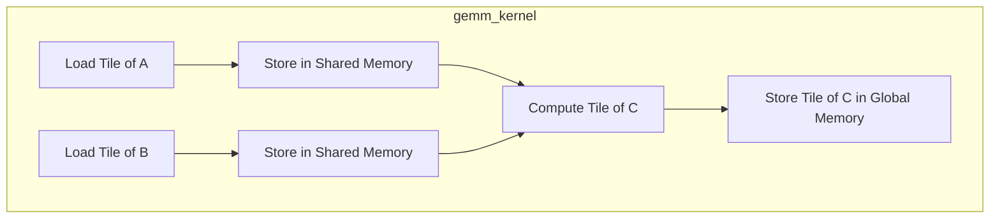
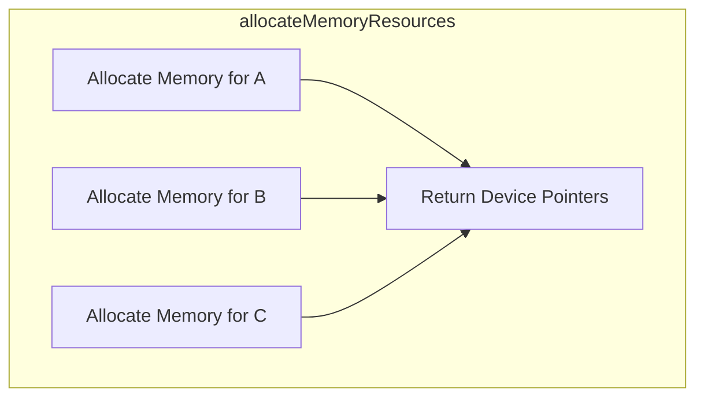
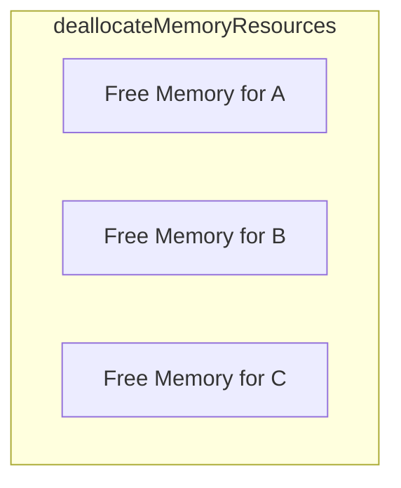
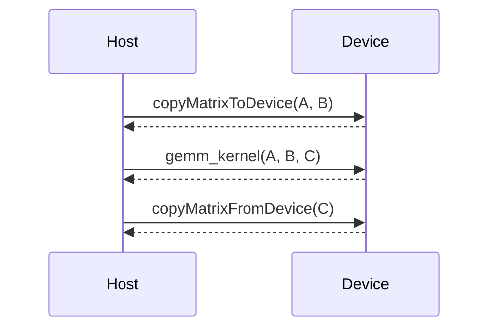
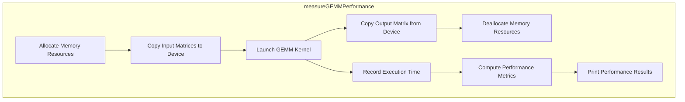

<details>
<summary>Relevant source files</summary>

The following files were used as context for generating this wiki page:

- [gemm/cugemm.cu](https://github.com/agattani123/cis6010/blob/main/gemm/cugemm.cu)
- [gemm/gemm.cu](https://github.com/agattani123/cis6010/blob/main/gemm/gemm.cu)
- [gemm/gemm.h](https://github.com/agattani123/cis6010/blob/main/gemm/gemm.h)
- [gemm/utils.h](https://github.com/agattani123/cis6010/blob/main/gemm/utils.h)
- [gemm/utils.cu](https://github.com/agattani123/cis6010/blob/main/gemm/utils.cu)

</details>

# CUDA GEMM Implementation

## Introduction

The CUDA GEMM (General Matrix Multiplication) implementation is a parallel matrix multiplication algorithm designed to run on NVIDIA GPUs using the CUDA programming model. It aims to leverage the massive parallelism of GPUs to achieve high-performance matrix multiplication, a fundamental operation in various scientific and engineering applications.

The implementation consists of several CUDA kernel functions and helper utilities for memory management, data transfer, and performance measurement. It supports both single-precision (float) and double-precision (double) data types for matrix elements.

Sources: [gemm.h:1-9](), [cugemm.cu:1-10](), [gemm.cu:1-10]()

## CUDA Kernel Functions

### `gemm_kernel`

The `gemm_kernel` is the main CUDA kernel function responsible for performing the matrix multiplication operation on the GPU. It follows a tiled approach, where the input matrices are divided into smaller tiles that can fit into the GPU's shared memory for efficient data reuse and coalesced memory access patterns.



The kernel is launched with a two-dimensional grid of thread blocks, where each thread block computes a tile of the output matrix C. Within each thread block, threads are organized into a two-dimensional array, and each thread computes a single element of the output tile.

Sources: [cugemm.cu:47-108](), [gemm.h:11-16]()

### `gemm_kernel_batched`

The `gemm_kernel_batched` is a variant of the `gemm_kernel` function that performs batched matrix multiplication. It takes an additional parameter `batchCount` and computes the matrix multiplication for multiple sets of input matrices in parallel.

```mermaid
flowchart TD
    subgraph gemm_kernel_batched
        tile_A[Load Tile of A] --> shared_A[Store in Shared Memory]
        tile_B[Load Tile of B] --> shared_B[Store in Shared Memory]
        shared_A & shared_B --> compute[Compute Tile of C]
        compute --> store[Store Tile of C in Global Memory]
        loop Batch Loop
            tile_A & tile_B & compute & store
        end
    end
```

This kernel is useful when multiple independent matrix multiplications need to be performed, as it can leverage the GPU's parallelism more efficiently by processing multiple batches concurrently.

Sources: [cugemm.cu:110-170](), [gemm.h:18-23]()

## Memory Management and Data Transfer

The implementation includes several utility functions for memory management and data transfer between the host (CPU) and device (GPU).

### `allocateMemoryResources`

This function allocates the necessary memory resources on the GPU for the input matrices A and B, as well as the output matrix C. It takes the matrix dimensions and data types as input and returns pointers to the allocated device memory.



Sources: [utils.cu:10-33](), [utils.h:6-12]()

### `deallocateMemoryResources`

This function deallocates the memory resources previously allocated on the GPU for the input and output matrices.



Sources: [utils.cu:35-46](), [utils.h:14-16]()

### `copyMatrixToDevice` and `copyMatrixFromDevice`

These functions are responsible for transferring matrix data between the host (CPU) and device (GPU) memory. `copyMatrixToDevice` copies the input matrices A and B from the host to the device, while `copyMatrixFromDevice` copies the output matrix C from the device to the host.



Sources: [utils.cu:48-76](), [utils.h:18-24]()

## Performance Measurement

The implementation includes a utility function `measureGEMMPerformance` to measure the performance of the CUDA GEMM implementation. It takes the matrix dimensions, data type, and a flag to indicate whether to perform the batched version of the matrix multiplication.



This function measures the end-to-end execution time, including memory transfers and kernel execution, and computes performance metrics such as the GFLOPS (Giga Floating-Point Operations per Second) achieved by the implementation.

Sources: [gemm.cu:12-89](), [gemm.h:25-31]()

## Example Usage

The CUDA GEMM implementation can be used as follows:

```cpp
#include "gemm.h"

int main() {
    int m = 1024, n = 1024, k = 1024;
    float *A, *B, *C;
    
    // Allocate host memory
    allocateMemoryResources(&A, &B, &C, m, n, k, sizeof(float));
    
    // Initialize input matrices
    // ...
    
    // Measure performance of single-precision GEMM
    measureGEMMPerformance(A, B, C, m, n, k, sizeof(float), false);
    
    // Measure performance of batched single-precision GEMM
    measureGEMMPerformance(A, B, C, m, n, k, sizeof(float), true);
    
    // Deallocate host and device memory
    deallocateMemoryResources(A, B, C);
    
    return 0;
}
```

This example demonstrates how to allocate memory for the input and output matrices, initialize the input matrices, measure the performance of the CUDA GEMM implementation for both single-precision and batched matrix multiplication, and finally deallocate the allocated memory.

Sources: [gemm.cu:91-108]()