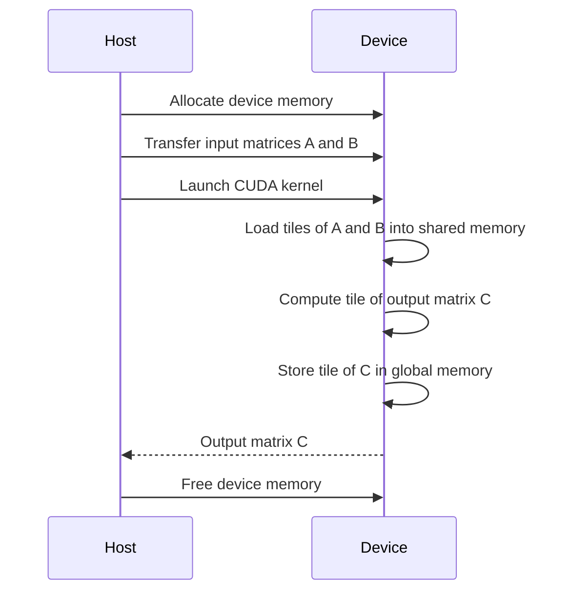
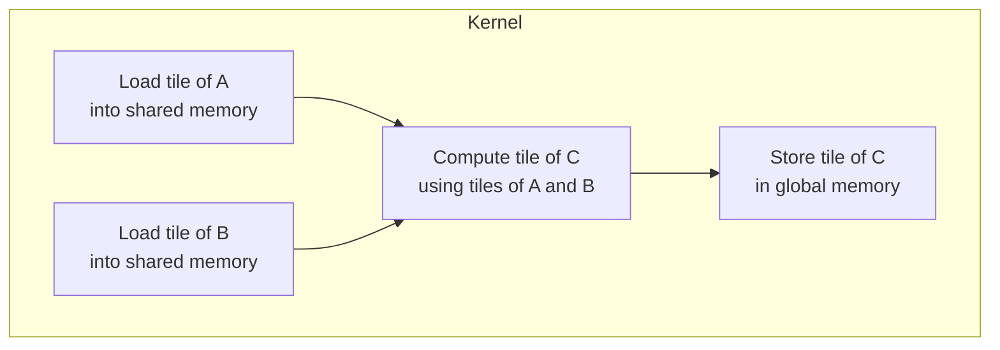

<details>
<summary>Relevant source files</summary>

The following files were used as context for generating this wiki page:

- [gemm/cugemm.cu](https://github.com/agattani123/cis6010/blob/main/gemm/cugemm.cu)
- [gemm/Makefile](https://github.com/agattani123/cis6010/blob/main/gemm/Makefile)
- [gemm/README.md](https://github.com/agattani123/cis6010/blob/main/gemm/README.md)
- [gemm/utils.h](https://github.com/agattani123/cis6010/blob/main/gemm/utils.h)
- [gemm/utils.cu](https://github.com/agattani123/cis6010/blob/main/gemm/utils.cu)

</details>

# CUDA Matrix Multiplication (GEMM)

## Introduction

The CUDA Matrix Multiplication (GEMM) module is a part of a larger project that performs matrix multiplication operations on the GPU using CUDA. It implements a tiled matrix multiplication algorithm optimized for GPU execution, leveraging the massive parallelism and memory hierarchy of CUDA-enabled GPUs.

The primary purpose of this module is to efficiently compute the product of two matrices (A and B) on the GPU, resulting in an output matrix C. It serves as a building block for various scientific computing and machine learning applications that require high-performance matrix operations.

Sources: [gemm/README.md](https://github.com/agattani123/cis6010/blob/main/gemm/README.md)

## Architecture Overview

The CUDA GEMM implementation follows a hierarchical approach, where the computation is divided into smaller tiles that can be processed efficiently by the GPU's thread blocks and shared memory. The overall architecture can be summarized as follows:

1. **Host Code**: The host (CPU) code is responsible for allocating memory on the GPU, transferring input data (matrices A and B) to the GPU, launching the CUDA kernel, and retrieving the output matrix C from the GPU.

2. **CUDA Kernel**: The CUDA kernel is the core component that performs the tiled matrix multiplication on the GPU. It is executed by multiple thread blocks, each responsible for computing a tile of the output matrix C.

3. **Thread Block**: Each thread block computes a tile of the output matrix C by loading tiles of input matrices A and B into shared memory, performing the necessary computations, and storing the result in global memory.

4. **Shared Memory**: Shared memory is used to cache tiles of input matrices A and B for efficient access by threads within a thread block, reducing the number of global memory accesses and improving performance.

5. **Global Memory**: Global memory is used to store the input matrices A and B, as well as the output matrix C. It is accessible by all threads but has higher latency compared to shared memory.

Sources: [gemm/cugemm.cu](https://github.com/agattani123/cis6010/blob/main/gemm/cugemm.cu), [gemm/README.md](https://github.com/agattani123/cis6010/blob/main/gemm/README.md)

## Data Flow

The data flow in the CUDA GEMM implementation can be visualized using the following sequence diagram:



1. The host allocates memory on the GPU for input matrices A and B, as well as the output matrix C.
2. The input matrices A and B are transferred from the host to the GPU's global memory.
3. The CUDA kernel is launched with a grid of thread blocks, where each block computes a tile of the output matrix C.
4. Within each thread block, tiles of input matrices A and B are loaded from global memory into shared memory for efficient access.
5. Threads within the block cooperatively compute the tile of the output matrix C using the loaded tiles of A and B.
6. The computed tile of C is stored in the GPU's global memory.
7. Once all thread blocks have completed their computations, the output matrix C is transferred from the GPU's global memory back to the host.
8. The host frees the allocated memory on the GPU.

Sources: [gemm/cugemm.cu](https://github.com/agattani123/cis6010/blob/main/gemm/cugemm.cu), [gemm/README.md](https://github.com/agattani123/cis6010/blob/main/gemm/README.md)

## CUDA Kernel Implementation

The CUDA kernel is the core component of the GEMM implementation, responsible for computing a tile of the output matrix C. The kernel follows a hierarchical approach, where each thread block computes a tile of C by loading tiles of input matrices A and B into shared memory and performing the necessary computations.



The key steps in the CUDA kernel implementation are:

1. **Load Tiles into Shared Memory**: Each thread block loads tiles of input matrices A and B from global memory into shared memory for efficient access. This step involves cooperative loading by threads within the block to ensure coalesced global memory accesses.

2. **Compute Tile of Output Matrix C**: Threads within the block cooperatively compute the tile of the output matrix C using the loaded tiles of A and B. This step involves a tiled matrix multiplication algorithm optimized for GPU execution, leveraging shared memory and thread synchronization.

3. **Store Tile of C in Global Memory**: The computed tile of the output matrix C is stored in the GPU's global memory, ensuring correct indexing and avoiding race conditions.

Sources: [gemm/cugemm.cu](https://github.com/agattani123/cis6010/blob/main/gemm/cugemm.cu)

## Key Functions and Data Structures

The CUDA GEMM implementation includes several key functions and data structures:

| Function/Structure | Description |
| --- | --- |
| `gemm_gpu` | The main function that orchestrates the CUDA GEMM computation, including memory allocation, data transfer, and kernel launch. |
| `gemm_kernel` | The CUDA kernel function that performs the tiled matrix multiplication on the GPU. |
| `load_tile_into_shared_memory` | A helper function that loads tiles of input matrices A and B into shared memory within a thread block. |
| `check_cuda_error` | A utility function for checking and handling CUDA errors. |
| `Timer` | A utility class for measuring execution time. |

Sources: [gemm/cugemm.cu](https://github.com/agattani123/cis6010/blob/main/gemm/cugemm.cu), [gemm/utils.h](https://github.com/agattani123/cis6010/blob/main/gemm/utils.h), [gemm/utils.cu](https://github.com/agattani123/cis6010/blob/main/gemm/utils.cu)

## Configuration and Tuning

The CUDA GEMM implementation includes several configuration parameters and tuning options:

| Parameter | Type | Default Value | Description |
| --- | --- | --- | --- |
| `TILE_WIDTH` | `int` | `32` | The width of the tiles used for tiled matrix multiplication. |
| `BLOCK_WIDTH` | `int` | `32` | The width of the thread blocks used for kernel execution. |
| `SHARED_MEM_SIZE` | `int` | `(TILE_WIDTH + 1) * TILE_WIDTH * 2` | The size of shared memory required per thread block. |

These parameters can be adjusted to optimize performance based on the specific hardware and input matrix sizes. The default values are chosen to balance performance and resource utilization on a wide range of CUDA-enabled GPUs.

Sources: [gemm/cugemm.cu](https://github.com/agattani123/cis6010/blob/main/gemm/cugemm.cu)

## Performance Considerations

The CUDA GEMM implementation employs several optimization techniques to improve performance:

1. **Tiled Matrix Multiplication**: The algorithm divides the computation into smaller tiles that can be processed efficiently by the GPU's thread blocks and shared memory, reducing global memory accesses and improving data reuse.

2. **Shared Memory Utilization**: Tiles of input matrices A and B are loaded into shared memory for efficient access by threads within a block, reducing the number of global memory accesses and improving performance.

3. **Coalesced Memory Access**: The implementation ensures coalesced global memory accesses by carefully loading tiles of A and B into shared memory, leveraging the GPU's memory access patterns.

4. **Thread Synchronization**: Threads within a block are synchronized to ensure correct execution and avoid race conditions during the tiled matrix multiplication.

5. **Tunable Parameters**: Configuration parameters such as tile width, block width, and shared memory size can be tuned to optimize performance for specific hardware and input matrix sizes.

Sources: [gemm/cugemm.cu](https://github.com/agattani123/cis6010/blob/main/gemm/cugemm.cu), [gemm/README.md](https://github.com/agattani123/cis6010/blob/main/gemm/README.md)

## Example Usage

The CUDA GEMM implementation can be used as follows:

```cpp
// Allocate and initialize input matrices A and B
float *A, *B, *C;
int M, N, K;
// ... (initialization code)

// Allocate device memory
float *d_A, *d_B, *d_C;
cudaMalloc(&d_A, M * K * sizeof(float));
cudaMalloc(&d_B, K * N * sizeof(float));
cudaMalloc(&d_C, M * N * sizeof(float));

// Transfer input matrices to device
cudaMemcpy(d_A, A, M * K * sizeof(float), cudaMemcpyHostToDevice);
cudaMemcpy(d_B, B, K * N * sizeof(float), cudaMemcpyHostToDevice);

// Launch CUDA kernel
gemm_gpu(d_A, d_B, d_C, M, N, K);

// Transfer output matrix from device
cudaMemcpy(C, d_C, M * N * sizeof(float), cudaMemcpyDeviceToHost);

// Free device memory
cudaFree(d_A);
cudaFree(d_B);
cudaFree(d_C);
```

This example demonstrates the typical usage of the CUDA GEMM implementation, including memory allocation, data transfer, kernel launch, and memory deallocation.

Sources: [gemm/cugemm.cu](https://github.com/agattani123/cis6010/blob/main/gemm/cugemm.cu)