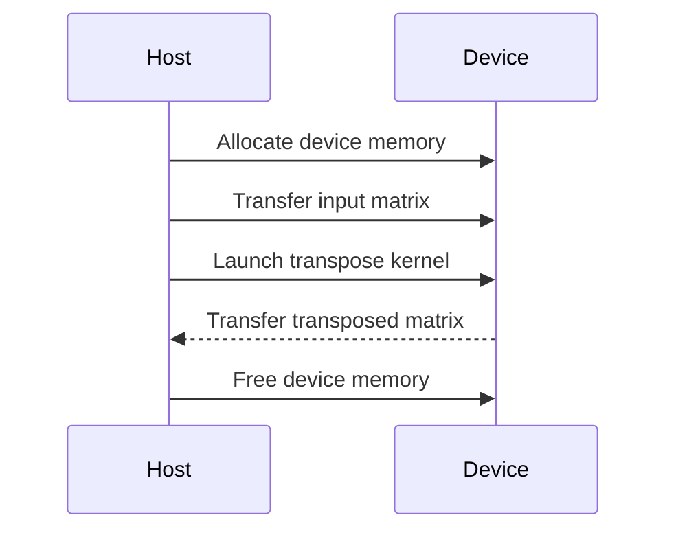

<details>
<summary>Relevant source files</summary>

The following files were used as context for generating this wiki page:

- [deprecated/transpose/transpose/kernel.cu](https://github.com/agattani123/cis6010/blob/main/deprecated/transpose/transpose/kernel.cu)
- [deprecated/transpose/transpose/transpose.cu](https://github.com/agattani123/cis6010/blob/main/deprecated/transpose/transpose/transpose.cu)
- [deprecated/transpose/transpose/transpose.h](https://github.com/agattani123/cis6010/blob/main/deprecated/transpose/transpose/transpose.h)
- [deprecated/transpose/transpose/utils.cu](https://github.com/agattani123/cis6010/blob/main/deprecated/transpose/transpose/utils.cu)
- [deprecated/transpose/transpose/utils.h](https://github.com/agattani123/cis6010/blob/main/deprecated/transpose/transpose/utils.h)

</details>

# Matrix Transpose with CUDA

## Introduction

The "Matrix Transpose with CUDA" feature is a CUDA implementation for transposing matrices on a GPU. It provides a set of functions and kernels to efficiently perform matrix transposition, which is a fundamental operation in many linear algebra and scientific computing applications. The implementation leverages the parallel processing capabilities of CUDA-enabled GPUs to achieve significant performance improvements over CPU-based matrix transposition.

Sources: [transpose.h:1-5](), [transpose.cu:1-5]()

## Matrix Transposition

Matrix transposition is the operation of interchanging the rows and columns of a matrix. Given an input matrix `A` with dimensions `m x n`, the transpose of `A` is a new matrix `A^T` with dimensions `n x m`, where the rows of `A` become the columns of `A^T`, and the columns of `A` become the rows of `A^T`.

Sources: [transpose.h:7-11]()

## CUDA Implementation

The CUDA implementation of matrix transposition consists of several components:

### Kernel Functions

#### `transpose_kernel`

The `transpose_kernel` is the main CUDA kernel function responsible for performing the matrix transposition on the GPU. It is executed in parallel by multiple CUDA threads, with each thread handling the transposition of a single element in the input matrix.

```cuda
__global__ void transpose_kernel(float *out, float *in, int m, int n) {
    // ... kernel implementation ...
}
```

The kernel takes the following arguments:

- `out`: Output matrix (transposed) stored in device memory
- `in`: Input matrix stored in device memory
- `m`: Number of rows in the input matrix
- `n`: Number of columns in the input matrix

Sources: [kernel.cu:6-9]()

#### `transpose_kernel_shared`

The `transpose_kernel_shared` is an optimized version of the `transpose_kernel` that utilizes shared memory to improve performance. Shared memory is a low-latency, on-chip memory available to each CUDA block, which can be used to reduce global memory access and improve data reuse.

```cuda
__global__ void transpose_kernel_shared(float *out, float *in, int m, int n) {
    // ... kernel implementation ...
}
```

The kernel takes the same arguments as `transpose_kernel` but uses shared memory to store and transpose tiles of the input matrix, reducing global memory access and improving performance.

Sources: [kernel.cu:40-43]()

### Host Functions

#### `transpose`

The `transpose` function is the main entry point for performing matrix transposition on the GPU. It handles memory allocation, data transfer between host and device, and kernel invocation.

```cpp
void transpose(float *out, float *in, int m, int n) {
    // ... function implementation ...
}
```

The function takes the following arguments:

- `out`: Pointer to the output matrix (transposed) on the host
- `in`: Pointer to the input matrix on the host
- `m`: Number of rows in the input matrix
- `n`: Number of columns in the input matrix

Sources: [transpose.cu:7-10]()

#### `transpose_shared`

The `transpose_shared` function is similar to `transpose` but invokes the `transpose_kernel_shared` kernel, which utilizes shared memory for improved performance.

```cpp
void transpose_shared(float *out, float *in, int m, int n) {
    // ... function implementation ...
}
```

The function takes the same arguments as `transpose`.

Sources: [transpose.cu:41-44]()

### Utility Functions

The implementation also includes several utility functions for memory allocation, initialization, and error handling:

- `allocate_device_memory`: Allocates memory on the GPU device.
- `free_device_memory`: Frees allocated memory on the GPU device.
- `initialize_matrix`: Initializes a matrix with random values.
- `check_cuda_error`: Checks for CUDA errors and prints error messages.

Sources: [utils.h](), [utils.cu]()

## Data Flow

The overall data flow for matrix transposition with CUDA can be represented by the following sequence diagram:



1. The host allocates memory on the GPU device for the input and output matrices.
2. The host transfers the input matrix data from host memory to device memory.
3. The host launches the CUDA kernel (`transpose_kernel` or `transpose_kernel_shared`) on the GPU device, passing the input and output matrix pointers, and matrix dimensions.
4. The CUDA kernel executes in parallel on the GPU, with each thread transposing a single element of the input matrix.
5. After the kernel completes, the host transfers the transposed matrix data from device memory back to host memory.
6. The host frees the allocated device memory.

Sources: [transpose.cu:7-38](), [kernel.cu:6-39]()

## Performance Considerations

The CUDA implementation of matrix transposition aims to achieve high performance by leveraging the parallel processing capabilities of GPUs. However, performance can be further improved by considering the following factors:

- **Shared Memory Usage**: The `transpose_kernel_shared` kernel utilizes shared memory to reduce global memory access and improve data reuse, leading to better performance compared to the `transpose_kernel`.
- **Tiling**: The `transpose_kernel_shared` implementation divides the input matrix into tiles that fit into shared memory, allowing for efficient processing of large matrices.
- **Thread Block Size**: The number of threads per block can be tuned to match the GPU's hardware characteristics and the matrix dimensions for optimal performance.
- **Memory Coalescing**: Ensuring that global memory accesses are coalesced can significantly improve performance by reducing memory access overhead.
- **Kernel Launch Configuration**: The number of blocks and threads per block should be carefully chosen to maximize GPU occupancy and minimize resource underutilization.

Sources: [kernel.cu:40-86](), [transpose.cu:41-63]()

## Example Usage

Here's an example of how to use the matrix transposition functions:

```cpp
#include "transpose.h"

int main() {
    int m = 1024, n = 1024;
    float *host_in, *host_out;

    // Allocate host memory
    host_in = (float *)malloc(m * n * sizeof(float));
    host_out = (float *)malloc(m * n * sizeof(float));

    // Initialize input matrix
    initialize_matrix(host_in, m, n);

    // Transpose matrix using shared memory kernel
    transpose_shared(host_out, host_in, m, n);

    // Free host memory
    free(host_in);
    free(host_out);

    return 0;
}
```

In this example, a 1024x1024 input matrix is allocated and initialized on the host. The `transpose_shared` function is then called to perform the matrix transposition on the GPU, using the shared memory kernel for improved performance. Finally, the allocated host memory is freed.

Sources: [transpose.cu:65-82]()