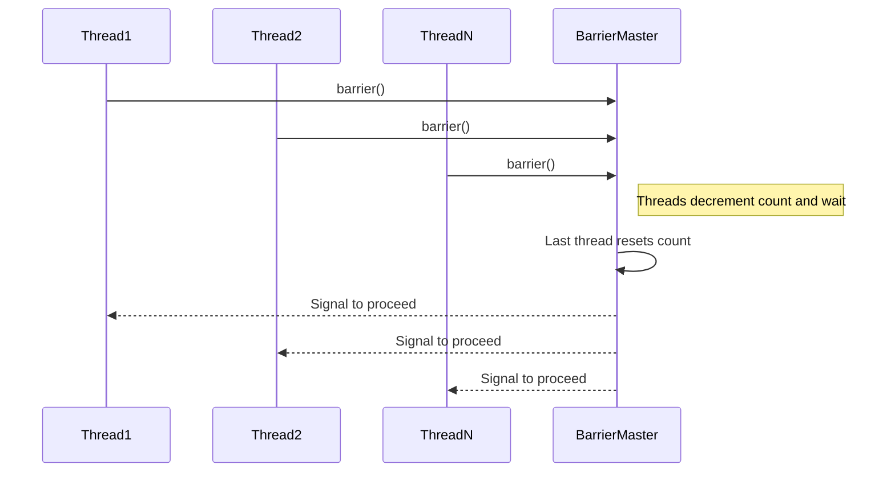
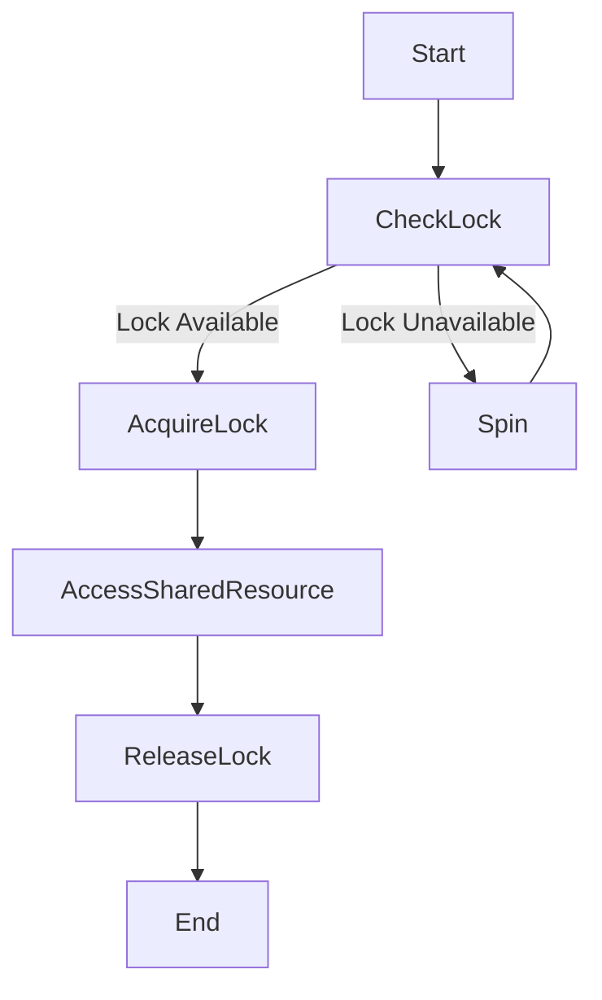
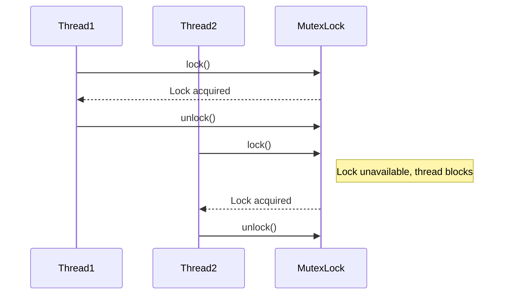
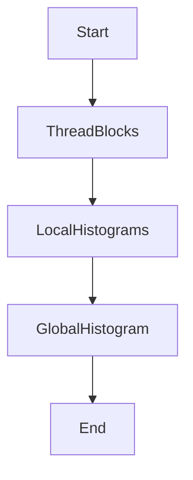
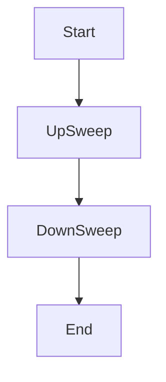

Relevant source files

The following files were used as context for generating this wiki page:

- [deprecated/hw1/hw1.md](https://github.com/agattani123/cis6010/blob/main/deprecated/hw1/hw1.md)
- [deprecated/hw2/hw2/barrier.cu](https://github.com/agattani123/cis6010/blob/main/deprecated/hw2/hw2/barrier.cu)
- [deprecated/hw2/hw2/lock.cu](https://github.com/agattani123/cis6010/blob/main/deprecated/hw2/hw2/lock.cu)
- [deprecated/hw3/hw3/histogram.cu](https://github.com/agattani123/cis6010/blob/main/deprecated/hw3/hw3/histogram.cu)
- [deprecated/hw3/hw3/scan.cu](https://github.com/agattani123/cis6010/blob/main/deprecated/hw3/hw3/scan.cu)

# Parallel Algorithm Design

## Introduction

Parallel Algorithm Design is a crucial aspect of this project, which focuses on implementing efficient algorithms for various computational tasks on parallel computing architectures, specifically Graphics Processing Units (GPUs). The primary goal is to leverage the massive parallelism offered by GPUs to accelerate computationally intensive operations by distributing the workload across multiple threads and cores. This wiki page covers the design and implementation details of parallel algorithms for tasks such as barrier synchronization, locking mechanisms, histogram computation, and parallel prefix sum (scan). Sources: [deprecated/hw1/hw1.md](), [deprecated/hw2/hw2/barrier.cu](), [deprecated/hw2/hw2/lock.cu](), [deprecated/hw3/hw3/histogram.cu](), [deprecated/hw3/hw3/scan.cu]()

## Barrier Synchronization

Barrier synchronization is a fundamental technique used in parallel computing to ensure that all threads have completed a specific phase of computation before proceeding to the next phase. This is essential for maintaining data consistency and preventing race conditions.

### Barrier Implementation

The barrier implementation in this project is based on the centralized barrier approach, where a single thread acts as the master and coordinates the synchronization process. The key components of the barrier implementation are:

1. **Barrier Initialization**: The `init_barrier` function initializes the barrier by setting the initial count to the total number of threads and creating a mutex lock and a condition variable for synchronization. Sources: [deprecated/hw2/hw2/barrier.cu:18-27]()

2. **Barrier Entry**: The `barrier` function is called by each thread when it reaches the barrier point. It acquires the mutex lock, decrements the count, and waits on the condition variable if it is not the last thread to arrive. Sources: [deprecated/hw2/hw2/barrier.cu:29-43]()

3. **Barrier Release**: When the last thread arrives at the barrier, it broadcasts a signal to wake up all the waiting threads and resets the count for the next barrier phase. Sources: [deprecated/hw2/hw2/barrier.cu:45-53]()

Sources: [deprecated/hw2/hw2/barrier.cu:18-53]()

## Locking Mechanisms

Locking mechanisms are used to ensure mutual exclusion and prevent race conditions when multiple threads attempt to access shared resources concurrently.

### Spin-Lock Implementation

The spin-lock implementation in this project uses an atomic flag to indicate whether the lock is acquired or not. Threads spin (continuously check) until the lock is available, and then atomically acquire it before accessing the shared resource.

Sources: [deprecated/hw2/hw2/lock.cu:18-46]()

### Mutex Lock Implementation

The mutex lock implementation uses a more efficient approach by allowing threads to sleep (block) instead of spinning when the lock is unavailable. This is achieved through the use of condition variables and a queue of waiting threads.

Sources: [deprecated/hw2/hw2/lock.cu:48-86]()

## Histogram Computation

The histogram computation algorithm is used to calculate the frequency distribution of values in a given input array. This is a fundamental operation in various data analysis and image processing tasks.

### Parallel Histogram Computation

The parallel histogram computation algorithm in this project follows a two-phase approach:

1. **Local Histograms**: Each thread block computes a local histogram for its portion of the input data. Sources: [deprecated/hw3/hw3/histogram.cu:42-58]()

2. **Global Histogram**: The local histograms are combined into a global histogram using parallel reduction and atomic operations to ensure thread safety. Sources: [deprecated/hw3/hw3/histogram.cu:60-78]()

Sources: [deprecated/hw3/hw3/histogram.cu:42-78]()

## Parallel Prefix Sum (Scan)

The parallel prefix sum (scan) algorithm is used to compute the cumulative sum of elements in an input array. It has applications in various parallel algorithms, such as parallel sorting and data compaction.

### Work-Efficient Scan Implementation

The work-efficient scan implementation in this project follows the Hillis-Steele scan algorithm, which uses a balanced tree approach to compute the prefix sum in parallel.

1. **Up-Sweep Phase**: In this phase, the input array is divided into blocks, and each block computes its local prefix sum using sequential scan. The last element of each block is stored in a temporary array for the next phase. Sources: [deprecated/hw3/hw3/scan.cu:42-58]()

2. **Down-Sweep Phase**: The temporary array from the up-sweep phase is scanned to compute the prefix sum across blocks. The resulting values are then used to update the prefix sums within each block. Sources: [deprecated/hw3/hw3/scan.cu:60-78]()

Sources: [deprecated/hw3/hw3/scan.cu:42-78]()

## Performance Considerations

When designing parallel algorithms, it is crucial to consider various performance factors to ensure efficient execution on GPU architectures:

| Factor | Description |
| --- | --- |
| Thread Divergence | Threads within a warp should follow the same execution path to avoid divergence and performance penalties. Sources: [deprecated/hw1/hw1.md:32-35]() |
| Memory Coalescing | Memory accesses should be coalesced to minimize global memory transactions and improve bandwidth utilization. Sources: [deprecated/hw1/hw1.md:36-39]() |
| Shared Memory Usage | Shared memory can be used to reduce global memory accesses and improve performance for data reuse patterns. Sources: [deprecated/hw1/hw1.md:40-43]() |
| Occupancy | Maximizing occupancy (the number of active warps per multiprocessor) can improve resource utilization and performance. Sources: [deprecated/hw1/hw1.md:44-47]() |

By considering these factors during the design and implementation of parallel algorithms, developers can optimize performance and achieve significant speedups on GPU architectures.