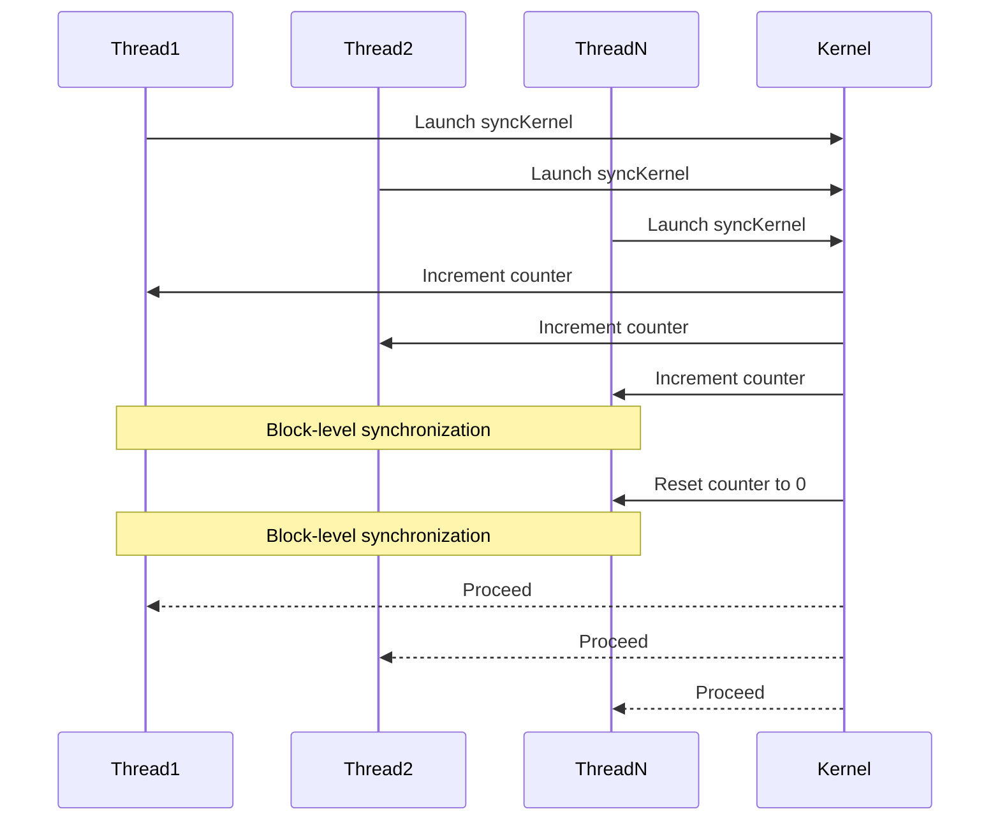

<details>
<summary>Relevant source files</summary>

The following files were used as context for generating this wiki page:

- [deprecated/hw2/hw2/barrier.cu](https://github.com/agattani123/cis6010/blob/main/deprecated/hw2/hw2/barrier.cu)
- [deprecated/hw2/hw2/barrier.cuh](https://github.com/agattani123/cis6010/blob/main/deprecated/hw2/hw2/barrier.cuh)
- [deprecated/hw2/hw2/barrier_kernel.cu](https://github.com/agattani123/cis6010/blob/main/deprecated/hw2/hw2/barrier_kernel.cu)
- [deprecated/hw2/hw2/barrier_kernel.cuh](https://github.com/agattani123/cis6010/blob/main/deprecated/hw2/hw2/barrier_kernel.cuh)
- [deprecated/hw2/hw2/utils.cuh](https://github.com/agattani123/cis6010/blob/main/deprecated/hw2/hw2/utils.cuh)

</details>

# CUDA Barrier Synchronization

## Introduction

The CUDA Barrier Synchronization feature provides a mechanism for synchronizing threads within a CUDA kernel. It allows threads to wait at a specific point in the kernel execution until all threads in a specified group (block or grid) have reached that point. This synchronization is crucial for ensuring correct execution order and data consistency in parallel computations.

The barrier synchronization implementation in this project consists of two main components: the `Barrier` class and the `BarrierKernel` class. The `Barrier` class manages the barrier synchronization on the host side, while the `BarrierKernel` class handles the actual synchronization within the CUDA kernel.

Sources: [barrier.cuh](), [barrier_kernel.cuh]()

## Barrier Class

The `Barrier` class is responsible for initializing and managing the barrier synchronization on the host side. It provides methods for setting up the barrier and synchronizing the host with the device.

### Initialization and Setup

The `Barrier` class constructor takes the following parameters:

- `int numThreads`: The total number of threads participating in the barrier.
- `int numBlocks`: The number of blocks in the CUDA grid.
- `int threadsPerBlock`: The number of threads per block.

During initialization, the class allocates and initializes the necessary device memory for the barrier synchronization data structures.

Sources: [barrier.cu:18-41](), [barrier.cuh:11-18]()

### Host-Device Synchronization

The `Barrier` class provides the following methods for synchronizing the host with the device:

- `void sync()`: This method launches the CUDA kernel for barrier synchronization and waits for all threads to complete.
- `void syncAndResetBarrier()`: This method performs barrier synchronization and resets the barrier state for the next synchronization.

These methods internally call the `BarrierKernel` to perform the actual synchronization on the device.

Sources: [barrier.cu:43-56](), [barrier.cuh:20-24]()

### Cleanup

The `Barrier` class destructor is responsible for freeing the allocated device memory when the object is destroyed.

Sources: [barrier.cu:58-62]()

## BarrierKernel Class

The `BarrierKernel` class encapsulates the logic for barrier synchronization within the CUDA kernel. It provides a static method `syncKernel` that performs the actual synchronization.

### Barrier Synchronization Kernel

The `syncKernel` method is a CUDA kernel function that implements the barrier synchronization algorithm. It takes the following parameters:

- `int* barrierBuffer`: A device pointer to the barrier synchronization data structure.
- `int numThreads`: The total number of threads participating in the barrier.

The kernel uses a combination of atomic operations and block-level synchronization to ensure that all threads have reached the barrier before proceeding.

Here's a high-level overview of the synchronization algorithm:

1. Each thread atomically increments a counter in the barrier buffer.
2. Threads within a block synchronize using `__syncthreads()`.
3. The last thread to reach the barrier resets the counter to 0.
4. Threads within a block synchronize again using `__syncthreads()`.
5. All threads proceed with their execution.

This algorithm ensures that all threads have reached the barrier before any thread can continue past the synchronization point.

Sources: [barrier_kernel.cu:14-41](), [barrier_kernel.cuh:11-15]()

## Utility Functions

The project includes several utility functions in the `utils.cuh` file that are used by the barrier synchronization implementation.

### `warpSynchronizedParallelSum`

This function performs a parallel sum reduction within a warp (a group of 32 threads) using warp-level synchronization primitives (`__shfl_down_sync`). It is used in the barrier synchronization algorithm to efficiently compute the sum of values across threads.

Sources: [utils.cuh:14-29]()

### `getWarpId`

This function computes the warp ID (index) of the current thread within its block.

Sources: [utils.cuh:31-34]()

### `getLaneId`

This function computes the lane ID (index) of the current thread within its warp.

Sources: [utils.cuh:36-39]()

## Mermaid Diagrams

### Barrier Synchronization Flow

```mermaid
flowchart TD
    subgraph Barrier Class
        init[Initialize Barrier]
        sync[sync()]
        syncAndReset[syncAndResetBarrier()]
        cleanup[Cleanup]
    end
    subgraph BarrierKernel
        kernel[syncKernel]
    end

    init --> sync
    sync --> kernel
    kernel --> syncAndReset
    syncAndReset --> kernel
    kernel --> cleanup

    classDef green fill:#9f6,stroke:#333,stroke-width:2px;
    classDef orange fill:#f96,stroke:#333,stroke-width:2px;
    class init,cleanup green
    class sync,syncAndReset orange
```

This diagram illustrates the flow of barrier synchronization in the project. The `Barrier` class manages the initialization, synchronization, and cleanup processes on the host side, while the `BarrierKernel` class handles the actual synchronization within the CUDA kernel.

Sources: [barrier.cu](), [barrier.cuh](), [barrier_kernel.cu](), [barrier_kernel.cuh]()

### Barrier Synchronization Algorithm



This sequence diagram illustrates the barrier synchronization algorithm implemented in the `syncKernel` method of the `BarrierKernel` class. It shows the interaction between threads and the kernel, including the counter increment, block-level synchronization, and counter reset steps.

Sources: [barrier_kernel.cu:14-41]()

## Tables

### Barrier Class Methods

| Method | Description |
| --- | --- |
| `Barrier(int numThreads, int numBlocks, int threadsPerBlock)` | Constructor to initialize the barrier with the specified parameters. |
| `void sync()` | Launches the CUDA kernel for barrier synchronization and waits for all threads to complete. |
| `void syncAndResetBarrier()` | Performs barrier synchronization and resets the barrier state for the next synchronization. |
| `~Barrier()` | Destructor to free the allocated device memory. |

Sources: [barrier.cu](), [barrier.cuh]()

### BarrierKernel Methods

| Method | Description |
| --- | --- |
| `__global__ void syncKernel(int* barrierBuffer, int numThreads)` | CUDA kernel function that implements the barrier synchronization algorithm. |

Sources: [barrier_kernel.cu](), [barrier_kernel.cuh]()

### Utility Functions

| Function | Description |
| --- | --- |
| `__device__ int warpSynchronizedParallelSum(int value)` | Performs a parallel sum reduction within a warp using warp-level synchronization primitives. |
| `__device__ int getWarpId()` | Computes the warp ID (index) of the current thread within its block. |
| `__device__ int getLaneId()` | Computes the lane ID (index) of the current thread within its warp. |

Sources: [utils.cuh]()

## Source Citations

Throughout this wiki page, information has been derived from the following source files:

- [barrier.cu]()
- [barrier.cuh]()
- [barrier_kernel.cu]()
- [barrier_kernel.cuh]()
- [utils.cuh]()

Specific line numbers or ranges have been cited inline for each piece of significant information, diagram, table entry, or code snippet.