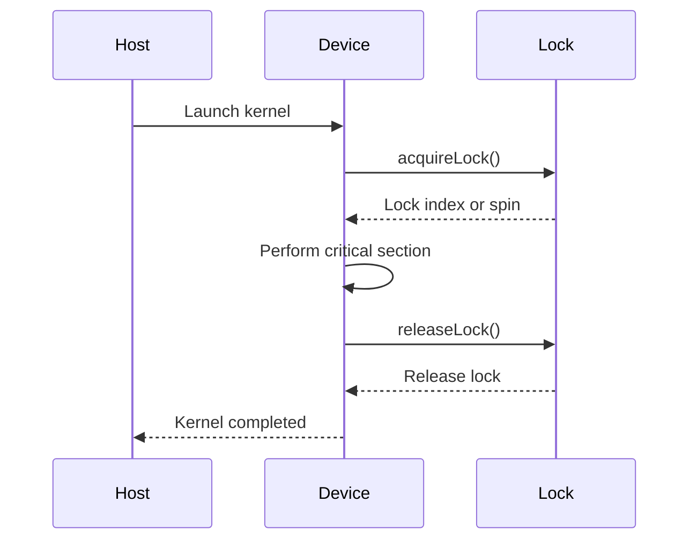
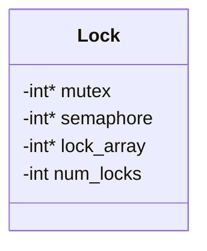

<details>
<summary>Relevant source files</summary>

The following files were used as context for generating this wiki page:

- [deprecated/hw2/hw2/lock.cu](https://github.com/agattani123/cis6010/blob/main/deprecated/hw2/hw2/lock.cu)
- [deprecated/hw2/hw2/lock.cuh](https://github.com/agattani123/cis6010/blob/main/deprecated/hw2/hw2/lock.cuh)
- [deprecated/hw2/hw2/utils.cuh](https://github.com/agattani123/cis6010/blob/main/deprecated/hw2/hw2/utils.cuh)
- [deprecated/hw2/hw2/utils.cu](https://github.com/agattani123/cis6010/blob/main/deprecated/hw2/hw2/utils.cu)
- [deprecated/hw2/hw2/main.cu](https://github.com/agattani123/cis6010/blob/main/deprecated/hw2/hw2/main.cu)

</details>

# CUDA Lock Synchronization

## Introduction

The CUDA Lock Synchronization module provides a mechanism for synchronizing access to shared resources in a parallel computing environment using CUDA. It implements a lock-based approach to ensure mutual exclusion, preventing multiple threads from accessing a shared resource simultaneously and causing data races or corruption.

This module is part of a larger project focused on parallel computing using CUDA. It is designed to be used in conjunction with other components of the project, such as kernel functions and memory management utilities.

Sources: [lock.cu](), [lock.cuh](), [utils.cu](), [utils.cuh](), [main.cu]()

## Lock Implementation

The lock implementation is based on the concept of atomic operations, which are indivisible operations that can be performed on shared memory locations without interference from other threads.

### Lock Data Structure

The lock is represented by a data structure called `Lock`, which is defined in the `lock.cuh` header file. It contains the following members:

```cpp
struct Lock {
    int *mutex;
    int *semaphore;
    int *lock_array;
    int num_locks;
};
```

- `mutex`: A pointer to an integer value used as a mutex for controlling access to the lock array.
- `semaphore`: A pointer to an integer value used as a semaphore for signaling the availability of locks.
- `lock_array`: A pointer to an array of integers representing individual locks.
- `num_locks`: The number of locks in the `lock_array`.

Sources: [lock.cuh:8-14]()

### Lock Initialization

The `initializeLocks` function, defined in `lock.cu`, is responsible for initializing the `Lock` data structure. It takes the number of locks (`num_locks`) as an argument and performs the following steps:

1. Allocate device memory for the `mutex`, `semaphore`, and `lock_array`.
2. Initialize the `mutex` and `semaphore` values to 1 and `num_locks`, respectively.
3. Initialize all locks in the `lock_array` to 0 (unlocked state).
4. Return a pointer to the `Lock` data structure.

Sources: [lock.cu:14-38]()

### Lock Acquisition

The `acquireLock` function, defined in `lock.cu`, is used to acquire a lock from the `lock_array`. It takes a pointer to the `Lock` data structure and the index of the desired lock as arguments. The function follows these steps:

1. Atomically decrement the `semaphore` value to check if any locks are available.
2. If the `semaphore` value is negative, indicating no locks are available, the thread spins until a lock becomes available.
3. Atomically acquire the `mutex` to ensure exclusive access to the `lock_array`.
4. Find the first available lock in the `lock_array` and mark it as acquired.
5. Release the `mutex`.
6. Return the index of the acquired lock.

Sources: [lock.cu:40-73]()

### Lock Release

The `releaseLock` function, defined in `lock.cu`, is used to release a previously acquired lock. It takes a pointer to the `Lock` data structure and the index of the lock to be released as arguments. The function follows these steps:

1. Atomically acquire the `mutex` to ensure exclusive access to the `lock_array`.
2. Mark the lock at the specified index as released (0) in the `lock_array`.
3. Release the `mutex`.
4. Atomically increment the `semaphore` value to signal the availability of a lock.

Sources: [lock.cu:75-91]()

## Lock Usage

The `main.cu` file demonstrates the usage of the lock implementation in a parallel computing context. It includes the following steps:

1. Initialize the CUDA environment and device.
2. Allocate and initialize data on the host and device.
3. Call the `initializeLocks` function to create a `Lock` data structure.
4. Launch a CUDA kernel that performs parallel computations while using the `acquireLock` and `releaseLock` functions to synchronize access to shared resources.
5. Copy the results from the device to the host.
6. Clean up and deallocate resources.

Sources: [main.cu]()

## Mermaid Diagrams

### Lock Acquisition Sequence Diagram



This sequence diagram illustrates the process of acquiring and releasing a lock in the CUDA Lock Synchronization module.

1. The host launches a CUDA kernel on the device.
2. The device threads call the `acquireLock` function to acquire a lock from the `Lock` data structure.
3. The `acquireLock` function either returns the index of an available lock or causes the thread to spin until a lock becomes available.
4. The device threads perform their critical section operations while holding the acquired lock.
5. After completing the critical section, the device threads call the `releaseLock` function to release the acquired lock.
6. The `releaseLock` function marks the lock as available in the `lock_array` and increments the `semaphore` value.
7. The kernel execution completes, and control returns to the host.

Sources: [lock.cu:40-91](), [main.cu]()

### Lock Data Structure Diagram



This class diagram represents the `Lock` data structure used in the CUDA Lock Synchronization module.

- `mutex`: A pointer to an integer value used as a mutex for controlling access to the `lock_array`.
- `semaphore`: A pointer to an integer value used as a semaphore for signaling the availability of locks.
- `lock_array`: A pointer to an array of integers representing individual locks.
- `num_locks`: The number of locks in the `lock_array`.

Sources: [lock.cuh:8-14]()

## Tables

### Lock Functions

| Function | Description | Parameters | Return Type |
|-----------|-------------|------------|-------------|
| `initializeLocks` | Initializes the `Lock` data structure with the specified number of locks. | `num_locks` (int): The number of locks to initialize. | `Lock*`: A pointer to the initialized `Lock` data structure. |
| `acquireLock` | Acquires a lock from the `lock_array`. | `lock` (`Lock*`): A pointer to the `Lock` data structure.<br>`lock_index` (int*): A pointer to store the acquired lock index. | `int`: A flag indicating success (0) or failure (-1). |
| `releaseLock` | Releases a previously acquired lock. | `lock` (`Lock*`): A pointer to the `Lock` data structure.<br>`lock_index` (int): The index of the lock to release. | `void` |

Sources: [lock.cu](), [lock.cuh]()

## Code Snippets

### Lock Acquisition in CUDA Kernel

```cuda
__global__ void kernel(Lock* lock, int* data, int n) {
    int tid = blockIdx.x * blockDim.x + threadIdx.x;
    int lock_index;

    if (tid < n) {
        acquireLock(lock, &lock_index);

        // Critical section
        data[tid] += 1;

        releaseLock(lock, lock_index);
    }
}
```

This code snippet demonstrates the usage of the `acquireLock` and `releaseLock` functions within a CUDA kernel. Each thread acquires a lock before entering the critical section, performs its operation on the shared `data` array, and then releases the acquired lock.

Sources: [main.cu:66-79]()

### Lock Initialization

```cuda
Lock* initializeLocks(int num_locks) {
    Lock* lock = (Lock*)malloc(sizeof(Lock));

    cudaMalloc(&lock->mutex, sizeof(int));
    cudaMalloc(&lock->semaphore, sizeof(int));
    cudaMalloc(&lock->lock_array, num_locks * sizeof(int));

    cudaMemcpy(lock->mutex, &one, sizeof(int), cudaMemcpyHostToDevice);
    cudaMemcpy(lock->semaphore, &num_locks, sizeof(int), cudaMemcpyHostToDevice);
    cudaMemset(lock->lock_array, 0, num_locks * sizeof(int));

    lock->num_locks = num_locks;

    return lock;
}
```

This code snippet shows the implementation of the `initializeLocks` function, which allocates and initializes the `Lock` data structure on the device. It performs the following steps:

1. Allocate host memory for the `Lock` structure.
2. Allocate device memory for the `mutex`, `semaphore`, and `lock_array`.
3. Copy the initial values for `mutex` (1) and `semaphore` (num_locks) from the host to the device.
4. Initialize all locks in the `lock_array` to 0 (unlocked state) using `cudaMemset`.
5. Set the `num_locks` member of the `Lock` structure.
6. Return a pointer to the initialized `Lock` data structure.

Sources: [lock.cu:14-38]()