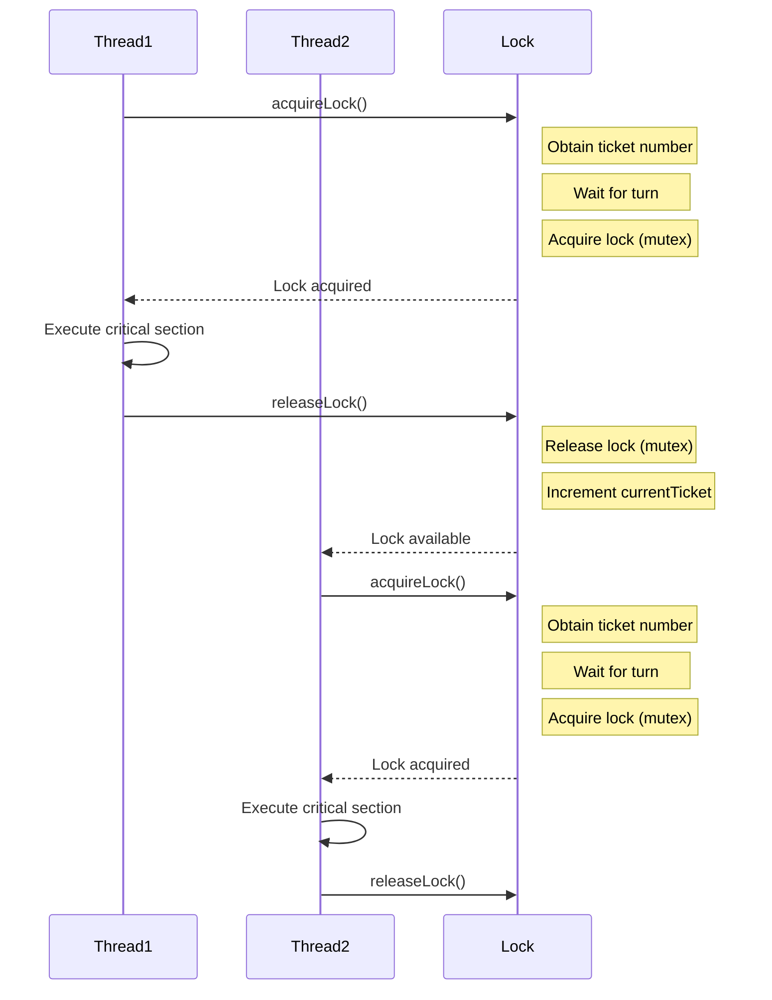

<details>
<summary>Relevant source files</summary>

The following files were used as context for generating this wiki page:

- [deprecated/hw2/hw2/lock.cu](https://github.com/agattani123/cis6010/blob/main/deprecated/hw2/hw2/lock.cu)
- [deprecated/hw2/hw2/lock.cuh](https://github.com/agattani123/cis6010/blob/main/deprecated/hw2/hw2/lock.cuh)
- [deprecated/hw2/hw2/lock_kernel.cu](https://github.com/agattani123/cis6010/blob/main/deprecated/hw2/hw2/lock_kernel.cu)
- [deprecated/hw2/hw2/lock_kernel.cuh](https://github.com/agattani123/cis6010/blob/main/deprecated/hw2/hw2/lock_kernel.cuh)
- [deprecated/hw2/hw2/main.cu](https://github.com/agattani123/cis6010/blob/main/deprecated/hw2/hw2/main.cu)

</details>

# Lock-based Synchronization

## Introduction

Lock-based synchronization is a mechanism used in parallel computing to ensure that certain critical sections of code are executed by only one thread or process at a time, preventing race conditions and ensuring data integrity. This wiki page focuses on the implementation of lock-based synchronization in the provided CUDA (Compute Unified Device Architecture) project, which aims to leverage the parallel computing capabilities of GPUs (Graphics Processing Units) for high-performance computing tasks.

The lock-based synchronization implementation in this project is designed to work with CUDA kernels, which are functions executed in parallel on the GPU's multiple cores. The synchronization mechanism allows threads within a CUDA kernel to acquire and release locks, ensuring that only one thread can access a shared resource or critical section at a time.

Sources: [lock.cu](), [lock.cuh](), [lock_kernel.cu](), [lock_kernel.cuh](), [main.cu]()

## Lock Implementation

### Lock Data Structure

The lock implementation is based on a data structure called `Lock`, which is defined in the `lock.cuh` header file. The `Lock` structure contains the following members:

```cpp
struct Lock {
    unsigned int *mutex;
    int *arrivalTicket;
    int *currentTicket;
};
```

- `mutex`: A pointer to an unsigned integer that serves as the lock's mutex (mutual exclusion) variable. This variable is used to control access to the critical section.
- `arrivalTicket`: A pointer to an integer that represents the ticket number assigned to a thread when it arrives at the lock.
- `currentTicket`: A pointer to an integer that represents the ticket number currently being served by the lock.

Sources: [lock.cuh:6-11]()

### Lock Initialization

The `initLock` function, defined in `lock.cu`, is responsible for initializing a `Lock` structure. It takes a `Lock` pointer as input and performs the following steps:

1. Allocate device memory for the `mutex`, `arrivalTicket`, and `currentTicket` members of the `Lock` structure.
2. Initialize the `mutex` to 0, indicating that the lock is initially available.
3. Initialize the `arrivalTicket` and `currentTicket` to 0, indicating that no threads have arrived or been served yet.

```cpp
void initLock(Lock *lock) {
    cudaMalloc(&lock->mutex, sizeof(unsigned int));
    cudaMalloc(&lock->arrivalTicket, sizeof(int));
    cudaMalloc(&lock->currentTicket, sizeof(int));

    cudaMemset(lock->mutex, 0, sizeof(unsigned int));
    cudaMemset(lock->arrivalTicket, 0, sizeof(int));
    cudaMemset(lock->currentTicket, 0, sizeof(int));
}
```

Sources: [lock.cu:4-13]()

### Lock Acquisition

The `acquireLock` function, defined in `lock_kernel.cu`, is a CUDA kernel function that implements the logic for acquiring a lock. It takes a `Lock` pointer as input and performs the following steps:

1. Obtain a unique ticket number for the current thread by atomically incrementing the `arrivalTicket` value.
2. Wait in a spin loop until the current thread's ticket number matches the `currentTicket` value, indicating that it's the thread's turn to acquire the lock.
3. Attempt to atomically acquire the lock by setting the `mutex` value to 1 using an atomic compare-and-swap operation.
4. If the lock acquisition is successful, the thread can proceed to execute the critical section.

```cpp
__device__ void acquireLock(Lock *lock) {
    int myTicket = atomicAdd(&lock->arrivalTicket, 1);
    while (myTicket != lock->currentTicket) {}
    bool isLocked = true;
    while (isLocked) {
        isLocked = atomicCAS(&lock->mutex, 0, 1) != 0;
    }
    __threadfence();
}
```

Sources: [lock_kernel.cu:4-13]()

### Lock Release

The `releaseLock` function, defined in `lock_kernel.cu`, is a CUDA kernel function that implements the logic for releasing a lock. It takes a `Lock` pointer as input and performs the following steps:

1. Set the `mutex` value to 0, indicating that the lock is now available.
2. Atomically increment the `currentTicket` value, allowing the next waiting thread to acquire the lock.

```cpp
__device__ void releaseLock(Lock *lock) {
    lock->mutex = 0;
    atomicAdd(&lock->currentTicket, 1);
}
```

Sources: [lock_kernel.cu:15-18]()

## Usage

The lock-based synchronization mechanism is used in the `main.cu` file, which serves as the entry point for the CUDA program. The `main` function performs the following steps:

1. Initialize a `Lock` structure using the `initLock` function.
2. Launch a CUDA kernel that performs some computation and uses the `acquireLock` and `releaseLock` functions to ensure thread-safe access to shared resources or critical sections.
3. Clean up and deallocate the memory used by the `Lock` structure.

```cpp
int main() {
    Lock lock;
    initLock(&lock);

    // Launch CUDA kernel that uses the lock
    // ...

    // Clean up
    cudaFree(lock.mutex);
    cudaFree(lock.arrivalTicket);
    cudaFree(lock.currentTicket);

    return 0;
}
```

Sources: [main.cu:6-19]()

## Sequence Diagram

The following sequence diagram illustrates the interaction between threads and the lock-based synchronization mechanism:



This diagram illustrates the following key points:

- Threads acquire a unique ticket number when they arrive at the lock.
- Threads wait in a spin loop until their ticket number matches the `currentTicket` value, indicating their turn to acquire the lock.
- Threads attempt to acquire the lock by setting the `mutex` value using an atomic compare-and-swap operation.
- After acquiring the lock, threads can execute the critical section.
- When a thread finishes executing the critical section, it releases the lock by setting the `mutex` value to 0 and incrementing the `currentTicket` value.
- The next waiting thread can then acquire the lock and proceed with executing the critical section.

Sources: [lock_kernel.cu:4-13](), [lock_kernel.cu:15-18]()

## Key Components

| Component | Description |
| --- | --- |
| `Lock` | A data structure containing the `mutex`, `arrivalTicket`, and `currentTicket` members used for lock-based synchronization. |
| `initLock` | A function that initializes a `Lock` structure by allocating device memory and setting initial values. |
| `acquireLock` | A CUDA kernel function that implements the logic for acquiring a lock, including obtaining a ticket number, waiting for the thread's turn, and atomically acquiring the lock. |
| `releaseLock` | A CUDA kernel function that implements the logic for releasing a lock, including setting the `mutex` value to 0 and incrementing the `currentTicket` value. |

Sources: [lock.cu](), [lock.cuh](), [lock_kernel.cu](), [lock_kernel.cuh]()