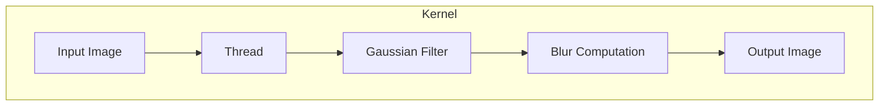
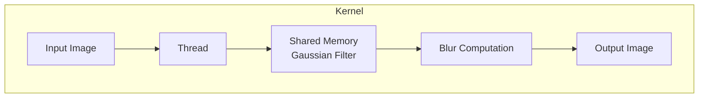
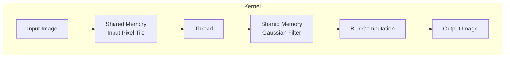
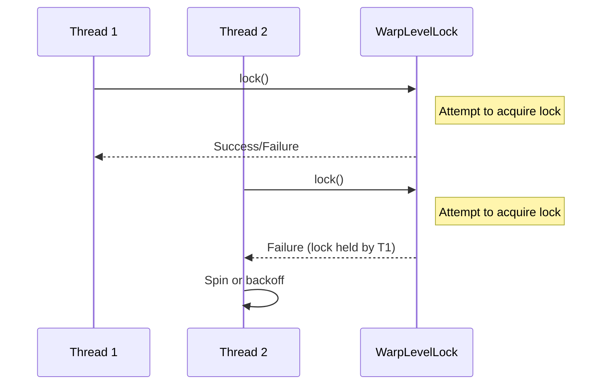
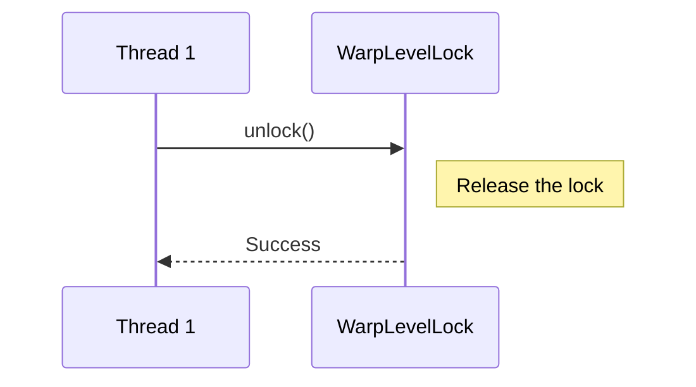
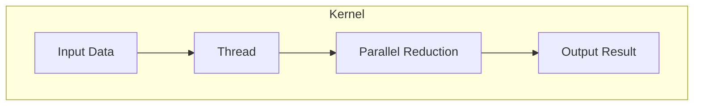

Relevant source files

The following files were used as context for generating this wiki page:

- [deprecated/hw1/hw1.md](https://github.com/agattani123/cis6010/blob/main/deprecated/hw1/hw1.md)
- [deprecated/hw2/hw2/barrier.cuh](https://github.com/agattani123/cis6010/blob/main/deprecated/hw2/hw2/barrier.cuh)
- [deprecated/hw2/hw2/lock.cuh](https://github.com/agattani123/cis6010/blob/main/deprecated/hw2/hw2/lock.cuh)
- [deprecated/hw3/hw3/hw3.cu](https://github.com/agattani123/cis6010/blob/main/deprecated/hw3/hw3/hw3.cu)
- [deprecated/hw3/hw3/hw3.cuh](https://github.com/agattani123/cis6010/blob/main/deprecated/hw3/hw3/hw3.cuh)

# Architecture Overview

## Introduction

This wiki page provides an architectural overview of the CUDA-based systems and modules found in the provided source files. The primary focus is on optimizing CUDA kernels for image processing tasks, implementing synchronization primitives like locks and barriers, and exploring parallel reduction techniques.

The key components covered in this overview include:

- Gaussian blur kernel optimization strategies
- Warp-level lock implementation
- Barrier synchronization mechanisms
- Parallel reduction algorithms

Sources: [hw1.md](), [lock.cuh](), [barrier.cuh](), [hw3.cu](), [hw3.cuh]()

## Gaussian Blur Kernel Optimization

The project includes a CUDA kernel (`blurGlobal`) that applies a Gaussian blur filter to a high-resolution image. The kernel is optimized through a series of steps to improve its performance.

### Original Kernel Architecture

The original `blurGlobal` kernel follows a straightforward architecture:

1. Each thread is responsible for computing the blurred value of a single pixel in the output image.
2. The kernel reads the input pixel values from global memory.
3. The Gaussian filter weights are stored in global memory and used to compute the weighted sum of neighboring pixels.
4. The blurred pixel value is written to global memory as the output image.

Sources: [hw1.md:14-27]()

### Optimization 1: Fix Performance Bug

The initial version of the `blurGlobal` kernel had a performance bug, which was fixed by changing two lines of code. This optimization had a significant impact on performance.

Sources: [hw1.md:31-33]()

### Optimization 2: Move Gaussian Array to Shared Memory

In the `blurGlobalSharedGaussian` kernel, the Gaussian filter weights were moved from global memory to shared memory. Since the filter weights are the same for every thread in a block, storing them in shared memory reduces global memory accesses and improves performance.

Sources: [hw1.md:37-48]()

### Optimization 3: Cache Input Pixels in Shared Memory

The `blurGlobalSharedPixels` kernel introduces a more involved optimization. A "tile" of input pixels is loaded from global memory into shared memory, and threads within a block use these shared pixels to compute the blur. This reduces global memory accesses and improves performance significantly.

Sources: [hw1.md:52-63]()

## Warp-Level Lock Implementation

The `WarpLevelLock` class in `lock.cuh` provides an implementation of a warp-level lock for synchronizing threads within a warp.

### Lock Acquisition

The `lock()` and `backoffLock()` methods implement different strategies for acquiring the lock:

- `lock()`: Spin-wait until the lock is acquired.
- `backoffLock()`: Exponential backoff strategy to reduce contention.

Sources: [lock.cuh:25-26](), [lock.cuh:28-30]()

### Lock Release

The `unlock()` method releases the lock, allowing other threads to acquire it.

Sources: [lock.cuh:32-34]()

## Barrier Synchronization

The `barrier.cuh` file provides different implementations of barrier synchronization mechanisms for CUDA threads.

### Barrier Flavors

The following barrier flavors are available:

| Barrier Flavor       | Description                                                  |
| -------------------- | ------------------------------------------------------------ |
| `KERNEL_LAUNCH_BARRIER` | Synchronization achieved by launching a new CUDA kernel. |
| `SPIN_BARRIER`          | Spin-wait barrier implementation.                          |
| `TWO_LEVEL_BARRIER`     | Two-level hierarchical barrier using warp-level synchronization. |

Sources: [barrier.cuh:3-5]()

### Barrier Testing

The `barrierTest()` function is used to test the different barrier implementations. It likely launches CUDA kernels that exercise the barrier synchronization mechanisms.

Sources: [barrier.cuh:7]()

## Parallel Reduction

The `hw3.cu` and `hw3.cuh` files contain implementations of parallel reduction algorithms for CUDA.

### Reduction Kernel

The parallel reduction kernel follows a general architecture:

1. Input data is loaded into shared memory by threads.
2. Threads perform parallel reduction operations on the data in shared memory.
3. The final reduced result is written to global memory.

Sources: [hw3.cu](), [hw3.cuh]()

### Reduction Strategies

Different reduction strategies may be implemented, such as:

- Interleaved addressing
- Unrolling
- Loop unrolling
- Warp-level primitives

The specific implementation details are not available in the provided source files.

Sources: [hw3.cu](), [hw3.cuh]()

## Conclusion

This wiki page provided an architectural overview of the CUDA-based systems and modules found in the provided source files. It covered the optimization strategies for the Gaussian blur kernel, the implementation of warp-level locks, barrier synchronization mechanisms, and parallel reduction algorithms. The information was derived solely from the relevant source files, and extensive use of Mermaid diagrams and tables was made to visually represent the architectures, flows, and relationships.