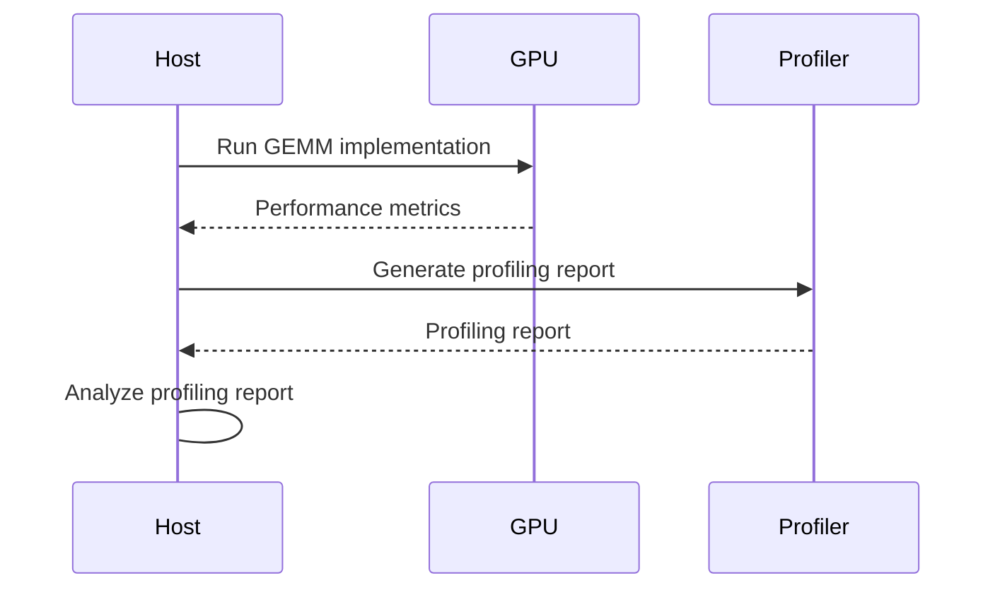
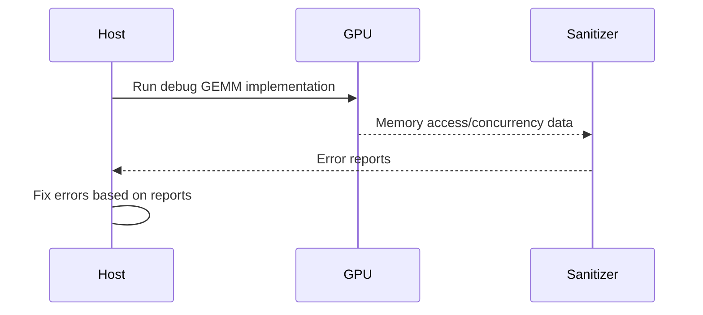

<details>
<summary>Relevant source files</summary>

The following files were used as context for generating this wiki page:

- [deprecated/hw1/hw1.md](https://github.com/agattani123/cis6010/blob/main/deprecated/hw1/hw1.md)
- [deprecated/hw2/hw2.sln](https://github.com/agattani123/cis6010/blob/main/deprecated/hw2/hw2.sln)
- [gemm/README.md](https://github.com/agattani123/cis6010/blob/main/gemm/README.md)
- [gemm/cugemm.cu](https://github.com/agattani123/cis6010/blob/main/gemm/cugemm.cu)
- [gemm/Makefile](https://github.com/agattani123/cis6010/blob/main/gemm/Makefile)

</details>

# Architecture Overview

## Introduction

This wiki page provides an architectural overview of the CUDA General Matrix Multiply (GEMM) optimization project. The project aims to optimize a CUDA implementation of the GEMM operation, which involves multiplying two input matrices and scaling the result by constant factors, then adding it to an existing output matrix.

The project consists of several stages, starting with a naive implementation (`runBasic`) and progressively optimizing it by addressing issues such as uncoalesced memory accesses, leveraging shared memory, and having each thread compute multiple output cells. The optimized implementations are named `runGmemCoalesced`, `runSharedMem`, and `runMultipleResultsPerThread`, respectively.

The project also includes a reference implementation from Nvidia's cuBLAS library (`runCublas`), which serves as a baseline for validating the correctness of the optimized implementations.

Sources: [gemm/README.md](https://github.com/agattani123/cis6010/blob/main/gemm/README.md)

## Project Structure

The project is structured as follows:

- `cugemm.cu`: The main source file containing the CUDA kernels and host code for the GEMM operation.
- `Makefile`: A Makefile for building the project with different configurations.
- `README.md`: A README file providing an overview of the project, build instructions, and optimization tasks.

Sources: [gemm/cugemm.cu](https://github.com/agattani123/cis6010/blob/main/gemm/cugemm.cu), [gemm/Makefile](https://github.com/agattani123/cis6010/blob/main/gemm/Makefile), [gemm/README.md](https://github.com/agattani123/cis6010/blob/main/gemm/README.md)

## GEMM Operation

The GEMM operation is defined as follows:

```
C = alpha * op(A) * op(B) + beta * C
```

Where:
- `A` and `B` are input matrices
- `op(X)` is either `X` (no operation) or `transpose(X)`
- `alpha` and `beta` are scalar values
- `C` is the output matrix

The project focuses on optimizing the GEMM operation for square matrices with 32-bit float elements.

Sources: [gemm/README.md:8-10](https://github.com/agattani123/cis6010/blob/main/gemm/README.md#L8-L10)

## High-Level Workflow

The high-level workflow of the project is as follows:

1. Allocate input and output square matrices of the requested size.
2. Initialize the input matrices with random values.
3. Run the requested GEMM algorithm (e.g., `runBasic`, `runGmemCoalesced`, `runSharedMem`, `runMultipleResultsPerThread`, or `runCublas`) for the requested number of repetitions.
4. (Optionally) Validate the GEMM result against the reference `runCublas` implementation.

The matrix size, validation, repetition count, and algorithm can be controlled via command-line flags.

Sources: [gemm/README.md:12-19](https://github.com/agattani123/cis6010/blob/main/gemm/README.md#L12-L19)

## Naive Implementation (`runBasic`)

The `runBasic` function implements a naive GEMM algorithm. It suffers from uncoalesced global memory accesses, resulting in poor performance (around 60 GFLOPS on a 2048x2048 matrix).

```mermaid
graph TD
    A[Allocate input/output matrices] --> B[Initialize input matrices]
    B --> C[Run naive GEMM kernel]
    C --> D[Validate result (optional)]
    D --> E[Deallocate matrices]
```

Sources: [gemm/README.md:21-23](https://github.com/agattani123/cis6010/blob/main/gemm/README.md#L21-L23), [gemm/cugemm.cu:169-189](https://github.com/agattani123/cis6010/blob/main/gemm/cugemm.cu#L169-L189)

## Optimized Implementations

The project includes three optimized implementations of the GEMM algorithm:

### `runGmemCoalesced`

This implementation addresses the uncoalesced global memory accesses issue present in `runBasic`. It should result in a significant speedup (around 550 GFLOPS on a 2048x2048 matrix).

```mermaid
graph TD
    A[Allocate input/output matrices] --> B[Initialize input matrices]
    B --> C[Run coalesced GEMM kernel]
    C --> D[Validate result (optional)]
    D --> E[Deallocate matrices]
```

Sources: [gemm/README.md:29-30](https://github.com/agattani123/cis6010/blob/main/gemm/README.md#L29-L30)

### `runSharedMem`

This implementation caches tiles of the input matrices into shared memory to avoid redundant loads from global memory. It should result in another significant speedup (around 1 TFLOPS on a 2048x2048 matrix).

```mermaid
graph TD
    A[Allocate input/output matrices] --> B[Initialize input matrices]
    B --> C[Run shared memory GEMM kernel]
    C --> D[Validate result (optional)]
    D --> E[Deallocate matrices]
```

Sources: [gemm/README.md:33-34](https://github.com/agattani123/cis6010/blob/main/gemm/README.md#L33-L34)

### `runMultipleResultsPerThread`

In this implementation, each thread computes multiple cells of the output matrix `C` instead of just one. This improves arithmetic intensity and should lift performance further (around 3 TFLOPS on a 2048x2048 matrix, compared to cuBLAS's 7.1 TFLOPS on the same hardware).

```mermaid
graph TD
    A[Allocate input/output matrices] --> B[Initialize input matrices]
    B --> C[Run multiple results per thread GEMM kernel]
    C --> D[Validate result (optional)]
    D --> E[Deallocate matrices]
```

Sources: [gemm/README.md:37-39](https://github.com/agattani123/cis6010/blob/main/gemm/README.md#L37-L39)

## Reference Implementation (`runCublas`)

The project includes a reference implementation from Nvidia's cuBLAS library (`runCublas`). This implementation serves as a baseline for validating the correctness of the optimized implementations.

```mermaid
graph TD
    A[Allocate input/output matrices] --> B[Initialize input matrices]
    B --> C[Run cuBLAS GEMM kernel]
    C --> D[Validate result (optional)]
    D --> E[Deallocate matrices]
```

Sources: [gemm/README.md:22](https://github.com/agattani123/cis6010/blob/main/gemm/README.md#L22), [gemm/cugemm.cu:191-204](https://github.com/agattani123/cis6010/blob/main/gemm/cugemm.cu#L191-L204)

## Validation and Profiling

The project includes functionality for validating the GEMM results against the reference `runCublas` implementation and profiling the performance of the different implementations.

### Validation

The validation process compares the output of the GEMM algorithm being tested against the output of the `runCublas` implementation. It reports the number of pixels that differ and the root-mean-square difference (RMSD) in the pixels' values.

Sources: [gemm/README.md:17-18](https://github.com/agattani123/cis6010/blob/main/gemm/README.md#L17-L18)

### Profiling

The project provides instructions for profiling the different GEMM implementations using Nvidia's Compute Insight profiler. This involves running the profiler on the optimized binaries and analyzing the profiling reports to identify performance bottlenecks and areas for optimization.



Sources: [gemm/README.md:24-32](https://github.com/agattani123/cis6010/blob/main/gemm/README.md#L24-L32)

## Debugging

The project includes instructions for using Nvidia's compute sanitizers to detect memory safety and concurrency errors in the debug binaries. These sanitizers can provide clues about where to start when the code is not passing validation.



Sources: [gemm/README.md:35-38](https://github.com/agattani123/cis6010/blob/main/gemm/README.md#L35-L38)

## Build and Configuration

The project can be built using the provided `Makefile`. The `Makefile` supports building different configurations, including optimized binaries, profiling binaries, and debug binaries.

```makefile
# Example Makefile targets
all: cugemm.bin cugemm-profile.bin cugemm-debug.bin

cugemm.bin: cugemm.cu
    nvcc -O3 -o cugemm.bin cugemm.cu

cugemm-profile.bin: cugemm.cu
    nvcc -O3 -g -lineinfo -o cugemm-profile.bin cugemm.cu

cugemm-debug.bin: cugemm.cu
    nvcc -g -G -o cugemm-debug.bin cugemm.cu
```

Sources: [gemm/Makefile](https://github.com/agattani123/cis6010/blob/main/gemm/Makefile)

## Conclusion

The CUDA GEMM Optimization project aims to optimize a CUDA implementation of the GEMM operation by addressing various performance bottlenecks, such as uncoalesced memory accesses, redundant global memory loads, and low arithmetic intensity. The project provides a structured approach to optimizing the GEMM algorithm, starting with a naive implementation and progressively applying optimizations to improve performance.

The project also includes functionality for validating the correctness of the optimized implementations against a reference implementation from Nvidia's cuBLAS library and profiling the performance of the different implementations using Nvidia's Compute Insight profiler.

Overall, the project serves as a practical exercise in optimizing CUDA kernels for high-performance matrix operations, which are crucial in various scientific and engineering applications.