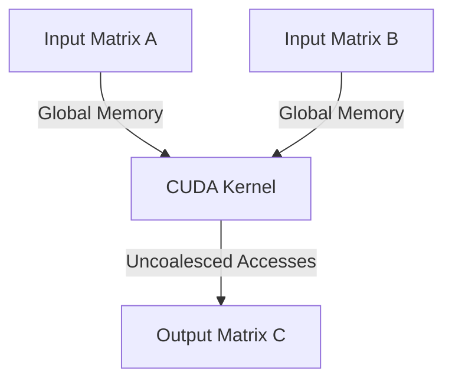
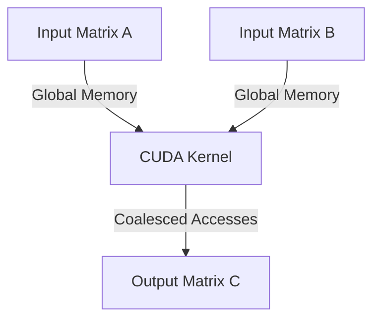
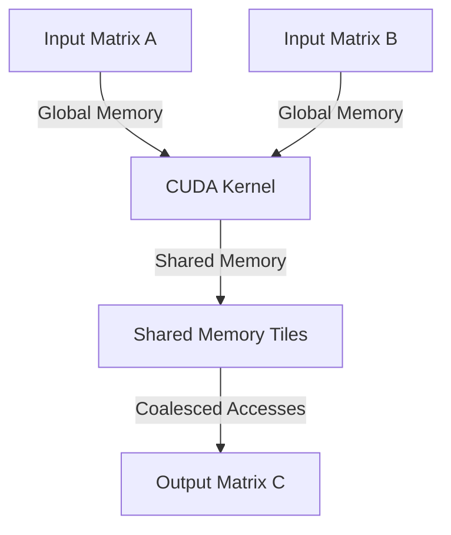
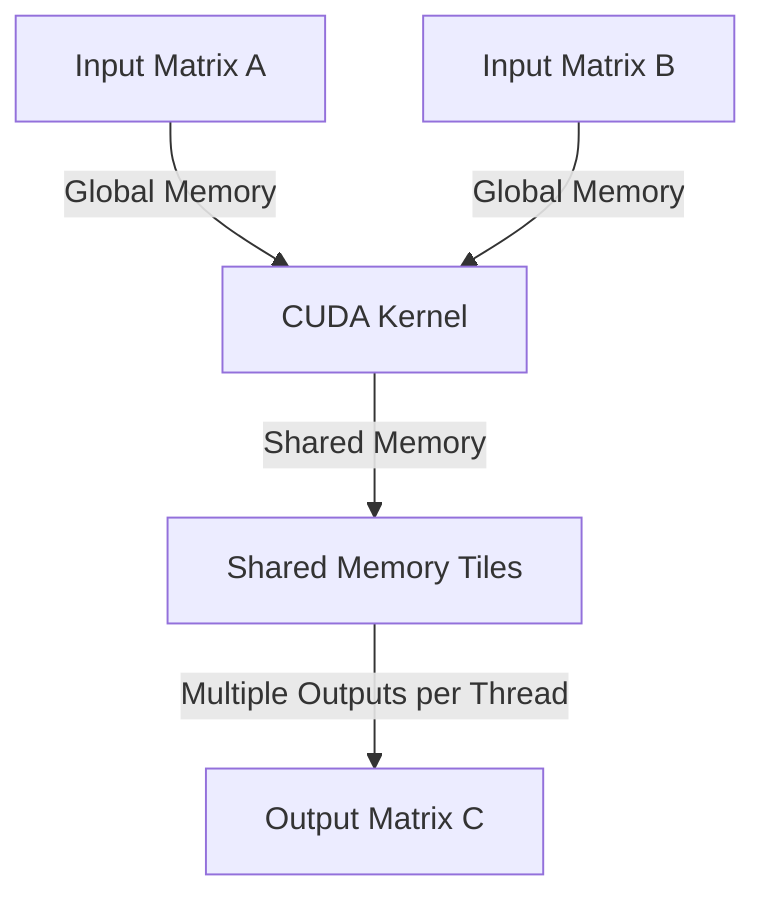

<details>
<summary>Relevant source files</summary>

The following files were used as context for generating this wiki page:

- [deprecated/hw1/hw1.md](https://github.com/agattani123/cis6010/blob/main/deprecated/hw1/hw1.md)
- [deprecated/hw2/hw2.sln](https://github.com/agattani123/cis6010/blob/main/deprecated/hw2/hw2.sln)
- [gemm/README.md](https://github.com/agattani123/cis6010/blob/main/gemm/README.md)
- [gemm/cugemm.cu](https://github.com/agattani123/cis6010/blob/main/gemm/cugemm.cu)
- [gemm/Makefile](https://github.com/agattani123/cis6010/blob/main/gemm/Makefile)

</details>

# Architecture Overview

## Introduction

This wiki page provides an overview of the architecture and implementation details for optimizing the General Matrix Multiply (GEMM) operation using CUDA. GEMM is a fundamental operation in linear algebra, widely used in various scientific and computational domains. The project aims to optimize the GEMM algorithm on GPU hardware, leveraging the parallel computing capabilities of CUDA to achieve high performance.

The optimization process involves several stages, starting with a naive implementation and progressively applying optimizations such as coalesced memory access, shared memory utilization, and increasing the arithmetic intensity by computing multiple output elements per thread.

Sources: [gemm/README.md](https://github.com/agattani123/cis6010/blob/main/gemm/README.md)

## GEMM Operation

The General Matrix Multiply (GEMM) operation is a fundamental linear algebra operation that computes the matrix product of two input matrices, A and B, and optionally scales and adds the result to an existing output matrix C. The mathematical representation of GEMM is:

```
C = alpha * op(A) * op(B) + beta * C
```

Where:
- `op(A)` and `op(B)` represent the transpose or non-transpose operations on matrices A and B, respectively.
- `alpha` and `beta` are scalar values used for scaling the matrix product and the existing output matrix C, respectively.

GEMM is a Level 3 BLAS (Basic Linear Algebra Subprograms) operation, known for its high computational intensity and efficient utilization of memory bandwidth.

Sources: [gemm/README.md:3](https://github.com/agattani123/cis6010/blob/main/gemm/README.md#L3)

## Project Structure

The project consists of a CUDA implementation of the GEMM operation, along with various optimization stages. The main components are:

1. **cugemm.cu**: The source file containing the CUDA kernels and host code for GEMM implementation and optimization.
2. **Makefile**: A Makefile for building the project with different optimization levels and debugging configurations.
3. **README.md**: A README file providing an overview of the project, build instructions, and optimization tasks.

Sources: [gemm/cugemm.cu](https://github.com/agattani123/cis6010/blob/main/gemm/cugemm.cu), [gemm/Makefile](https://github.com/agattani123/cis6010/blob/main/gemm/Makefile), [gemm/README.md](https://github.com/agattani123/cis6010/blob/main/gemm/README.md)

## Optimization Stages

The project follows a step-by-step optimization approach, starting with a naive implementation and progressively applying optimizations to improve performance. The optimization stages are as follows:

### 1. Naive Implementation (runBasic)

The initial implementation, `runBasic`, is a straightforward CUDA kernel that computes the GEMM operation. However, this implementation suffers from uncoalesced global memory accesses, resulting in poor performance.



Sources: [gemm/README.md:24-26](https://github.com/agattani123/cis6010/blob/main/gemm/README.md#L24-L26), [gemm/cugemm.cu](https://github.com/agattani123/cis6010/blob/main/gemm/cugemm.cu)

### 2. Coalesced Global Memory Access (runGmemCoalesced)

The first optimization stage involves fixing the uncoalesced global memory accesses in the `runBasic` implementation. This is achieved by copying the `runBasic` code to `runGmemCoalesced` and modifying the kernel to ensure coalesced memory access patterns.



This optimization should result in a significant performance improvement, reaching approximately 550 GFLOPS on 2048<sup>2</sup> input matrices.

Sources: [gemm/README.md:32-34](https://github.com/agattani123/cis6010/blob/main/gemm/README.md#L32-L34)

### 3. Shared Memory Utilization

The next optimization stage involves caching tiles of the input matrices into shared memory to avoid redundant loads from global memory. This optimization should further improve performance by reducing global memory accesses.



This optimization is expected to lift performance to approximately 1 TFLOPS.

Sources: [gemm/README.md:37-39](https://github.com/agattani123/cis6010/blob/main/gemm/README.md#L37-L39)

### 4. Multiple Results per Thread

The final optimization stage involves having each thread compute multiple cells of the output matrix C, instead of just one. This optimization improves the arithmetic intensity of the kernel, leading to better utilization of the GPU's computational resources.



This optimization is expected to further boost performance to approximately 3 TFLOPS, which is over 40% of the optimal performance achieved by Nvidia's cuBLAS library on the same hardware.

Sources: [gemm/README.md:42-44](https://github.com/agattani123/cis6010/blob/main/gemm/README.md#L42-L44)

## Performance Evaluation

The project includes a reference implementation from Nvidia's cuBLAS library, which serves as a baseline for validating the correctness of the optimized GEMM implementations. The performance of each optimization stage can be evaluated by running the corresponding kernel and comparing its performance with the cuBLAS implementation.

The project provides command-line flags to control various aspects of the execution, such as matrix size, number of repetitions, algorithm selection, and validation against the cuBLAS reference.

Sources: [gemm/README.md:16-22](https://github.com/agattani123/cis6010/blob/main/gemm/README.md#L16-L22)

## Debugging and Profiling

The project includes support for debugging and profiling the CUDA kernels using Nvidia's compute sanitizers and profiling tools. These tools can help identify memory safety issues, concurrency errors, and performance bottlenecks in the CUDA kernels.

The compute sanitizers can be run on the debug binaries to get better reporting of errors in the source code:

```
compute-sanitizer --tool memcheck ./cugemm-debug.bin ...
compute-sanitizer --tool racecheck ./cugemm-debug.bin ...
```

The Nvidia Compute Insight profiler can be used to analyze the performance of the kernels and identify potential optimizations:

```
sudo /usr/local/cuda-11.8/bin/ncu -o profile-basic --set full ./cugemm-profile.bin --size=4096 --reps=1 --algo=1 --validate=false
```

Sources: [gemm/README.md:27-31](https://github.com/agattani123/cis6010/blob/main/gemm/README.md#L27-L31)

## Conclusion

The GEMM optimization project aims to achieve high-performance matrix multiplication on GPU hardware using CUDA. By applying a series of optimizations, including coalesced memory access, shared memory utilization, and increasing arithmetic intensity, the project demonstrates the potential of leveraging parallel computing capabilities for computationally intensive linear algebra operations.

The project provides a structured approach to optimizing CUDA kernels, starting from a naive implementation and progressively applying performance-enhancing techniques. The use of profiling tools and debugging utilities ensures the correctness and efficiency of the optimized implementations.

Sources: [gemm/README.md](https://github.com/agattani123/cis6010/blob/main/gemm/README.md)